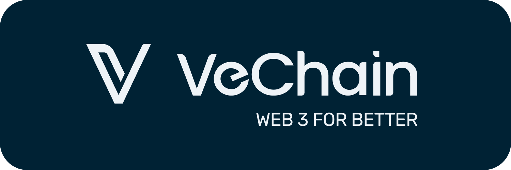

<div align="center">
  <p align="center">
    <a href="https://www.vechain.org/vechainthor/">
      <picture>
          
      </picture>
    </a>
  </p>
  <h1><code>vechain-sdk-js</code></h1>
  <p>
    <strong>The official JavaScript SDK for VeChain.</strong>
  </p>
  <p>
    <a href="https://github.com/vechain/vechain-sdk-js/actions/workflows/on-main.yml"></a>
    <a href="https://sonarcloud.io/project/overview?id=vechain_vechain-sdk"></a>
    <a href="https://sonarcloud.io/project/overview?id=vechain_vechain-sdk"></a>
    <a href="https://sonarcloud.io/project/overview?id=vechain_vechain-sdk"></a>
    <a href="https://sonarcloud.io/project/overview?id=vechain_vechain-sdk"></a>
    <a href="https://github.com/vechain/vechain-sdk-js/blob/main/.github/LICENSE.md"></a>
  </p>
  <div>
    <p>
    ❓ Have questions? Reach out to one of our community channels below!
    </p>
    <p align="center">
        <a href="https://discord.gg/vechain"></a>
        <a href="https://t.me/vechainandfriends"></a>
        <a href="https://www.reddit.com/r/Vechain"></a>
    </p>
  </div>
</div>

## Introduction

🚀 Welcome to the **vechain SDK**, your passport to the dazzling universe of decentralized wonders on the VeChain blockchain. Brace yourself for a coding adventure like no other! Whether you're a blockchain bard or a coding wizard, our SDK is your key to unlocking the mysteries of secure and seamless blockchain development. Join us in this epic journey, where lines of code transform into spells of innovation, and every commit propels you deeper into the enchanted realms of VeChainThor. Ready to embark on a coding odyssey? Let the VeChain SDK be your guide! 🌌🔮

## Contents

| Section | Description |
|---------|-------------|
| [Repository Structure](./readme/repositoryStructure.md) | Overview of the SDK's repository organization, including apps, docker configurations, documentation, and package structure. |
| [SDK Development](./readme/sdkDevelopment.md) | Guide for setting up the development environment, prerequisites, and common development commands. |
| [Documentation and Examples](./readme/docsAndExamples.md) | Information about SDK documentation, code examples, templates, and architecture diagrams. |
| [Integration Testing](./readme/integrationTesting.md) | Instructions for running integration tests using thor-solo node and setting up custom test environments. |
| [Troubleshooting](./readme/troubleshooting.md) | Solutions for common issues, particularly focused on Next.js configuration and compatibility. |
| [CONTRIBUTING](./.github/CONTRIBUTING.md) | If you want to contribute to this project and make it better, your help is very welcome.  |


## Experimental Features
We are continuously working on new features and improvements to enhance the SDK.
You can enable experimental features of specific cryptographic modules by use `useExperimentalCryptography` function of a specific module.

For example:

```typescript
keystore.useExperimentalCryptography(true)
```

## License

This project is licensed under the [MIT license](./.github/LICENSE.md).

## Publishing

The VeChain SDK uses `Changesets CLI`. To publish a new release:
``` bash
yarn pre-release X.Y.Z
yarn changeset publish
```
Finally, update also the [documentation](https://github.com/vechain/vechain-docs).

## NodeJS Version

The SDK is tested on LTS versions of NodeJS, to check LTS versions see: [NodeJS end of life](https://endoflife.date/nodejs)

## HTTP Tracing

To aid debugging of http request to thor blockchain, if the environment variable: `SDK_TRACE` is set to `true`, each http request and response will be logged to console.

## Contact information

- Discord https://discord.com/invite/vechain
- Support https://support.vechain.org

                              @@@@@@@@@@@@@@                     /@@@@@                   
                               @@@@@@@@@@@@@@@@                 @@@@@@                    
                                @@@@@@     @@@@@               @@@@@                      
                                  @@@@@     @@@@@             @@@@@                       
                                   @@@@@     @@@@@&          @@@@@                        
                                    @@@@@     @@@@@@       %@@@@@                         
                                     @@@@@      @@@@@     @@@@@%                          
                                      @@@@@@     @@@@@   @@@@@                            
                                        @@@@@     @@@   @@@@@                             
                                         @@@@@     @   @@@@@                              
                                          @@@@@      @@@@@@                               
                                           @@@@@    @@@@@#                                
                                            @@@@@@ @@@@@                                  
                                              @@@@@@@@@                                   
                                               @@@@@@@                       

