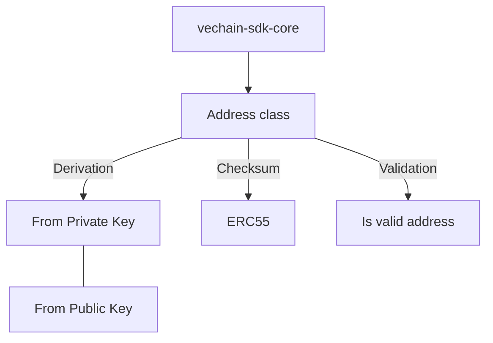

# Address class

This class handles all address related operations:

* Address derivation (from the private and public key)
* Address checking
* Address ERC55 Checksum

# Diagram



# Example

## Address Derivation

Here we have a simple example of address derivation:
```typescript { name=address-derivation, category=example }
import { Address, Hex } from '@vechain/sdk-core';
import { expect } from 'expect';

// Derive address from a private key
const addressFromPrivateKey = Address.ofPrivateKey(
    Hex.of('0x7582be841ca040aa940fff6c05773129e135623e41acce3e0b8ba520dc1ae26a')
        .bytes
).toString();
console.log(addressFromPrivateKey); // 0xd989829d88B0eD1B06eDF5C50174eCfA64F14A64

// Derive address from a public key
const addressFromExtendedPublicKey = Address.ofPublicKey(
    Hex.of(
        '04b90e9bb2617387eba4502c730de65a33878ef384a46f1096d86f2da19043304afa67d0ad09cf2bea0c6f2d1767a9e62a7a7ecc41facf18f2fa505d92243a658f'
    ).bytes
).toString();
console.log(addressFromExtendedPublicKey); // 0xd989829d88B0eD1B06eDF5C50174eCfA64F14A64
```

## Address Validation

Here we have a simple example of address validation:
```typescript { name=address-validation, category=example }
import { Address } from '@vechain/sdk-core';
import { expect } from 'expect';

// Valid address
console.log(Address.isValid('0x8617E340B3D01FA5F11F306F4090FD50E238070D')); // true

// Invalid address
console.log(Address.isValid('52908400098527886E0F7030069857D2E4169EE7')); // false
```

## Address Checksum

Here we have a simple example of address ERC55 checksum:
```typescript { name=address-erc55-checksum, category=example }
import { Address, HexUInt } from '@vechain/sdk-core';
import { expect } from 'expect';

// Address without ERC55 checksum
const unchecksummedAddress = HexUInt.of(
    '0x8617E340B3D01FA5F11F306F4090FD50E238070D'.toLowerCase()
);

// Address with ERC55 checksum
const checksummedAddress = Address.checksum(unchecksummedAddress);

console.log(checksummedAddress); // 0x8617E340B3D01FA5F11F306F4090FD50E238070D
```

