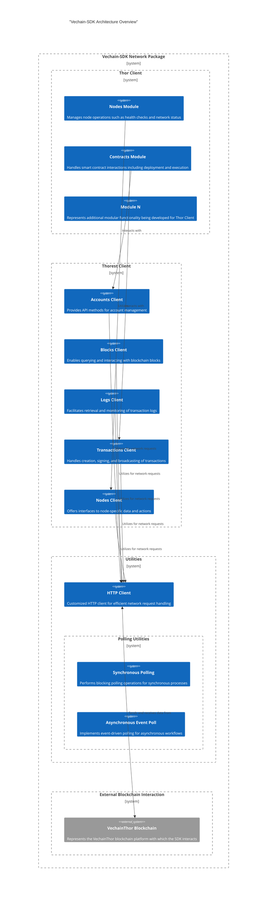

```mermaid
C4Context
    title "Vechain-SDK Architecture Overview"

    Boundary(b0, "Vechain-SDK Network Package") {
        Boundary(b1, "Thor Client") {
            System(nodes_module, "Nodes Module", "Manages node operations such as health checks and network status")
            System(contracts_module, "Contracts Module", "Handles smart contract interactions including deployment and execution")
            System(module_N, "Module N", "Represents additional modular functionality being developed for Thor Client")
        }
        
        Boundary(b2, "Thorest Client") {
            System(accounts_client, "Accounts Client", "Provides API methods for account management")
            System(blocks_client, "Blocks Client", "Enables querying and interacting with blockchain blocks")
            System(logs_client, "Logs Client", "Facilitates retrieval and monitoring of transaction logs")
            System(transactions_client, "Transactions Client", "Handles creation, signing, and broadcasting of transactions")
            System(nodes_client, "Nodes Client", "Offers interfaces to node-specific data and actions")
        }

        Boundary(b3, "Utilities") {
            System(http_client, "HTTP Client", "Customized HTTP client for efficient network request handling")
            Boundary(b5, "Polling Utilities"){
                System(sync_poll, "Synchronous Polling", "Performs blocking polling operations for synchronous processes")
                System(async_poll, "Asynchronous Event Poll", "Implements event-driven polling for asynchronous workflows")
            }
        }
        
        Boundary(b4, "External Blockchain Interaction") {
            System_Ext(vechainthor, "VechainThor Blockchain", "Represents the VechainThor blockchain platform with which the SDK interacts")
        }
    }

    Rel(nodes_module, nodes_client, "Utilizes")
    Rel(contracts_module, transactions_client, "Interacts with")
    Rel(contracts_module, accounts_client, "Interacts with")
    
    Rel(accounts_client, http_client, "Utilizes for network requests")
    Rel(blocks_client, http_client, "Utilizes for network requests")
    Rel(logs_client, http_client, "Utilizes for network requests")
    Rel(transactions_client, http_client, "Utilizes for network requests")
    Rel(nodes_client, http_client, "Utilizes for network requests")
    BiRel(http_client, vechainthor, "Sends and receives data from")

    UpdateLayoutConfig($c4ShapeInRow="3", $c4BoundaryInRow="1")
```