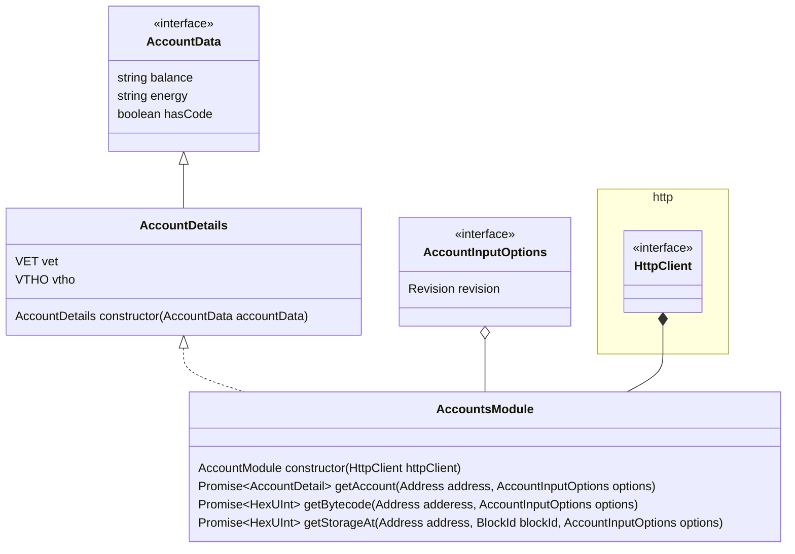

```mermaid
classDiagram
    class AccountData {
        <<interface>>
        string balance
        string energy
        boolean hasCode
    }
    class AccountDetails {
        VET vet
        VTHO vtho
        AccountDetails constructor(AccountData accountData)
    }
    class AccountInputOptions {
        <<interface>>
        Revision revision
    }
    class AccountsModule {
        AccountModule constructor(HttpClient httpClient)
        Promise~AccountDetail~ getAccount(Address address, AccountInputOptions options)
        Promise~HexUInt~ getBytecode(Address adderess, AccountInputOptions options)
        Promise~HexUInt~ getStorageAt(Address address, BlockId blockId, AccountInputOptions options)
    }
    namespace http {
        class HttpClient {
            <<interface>>
        }
    }
    AccountData <|-- AccountDetails
    AccountDetails <|.. AccountsModule
    AccountInputOptions o-- AccountsModule
    HttpClient *-- AccountsModule
```
