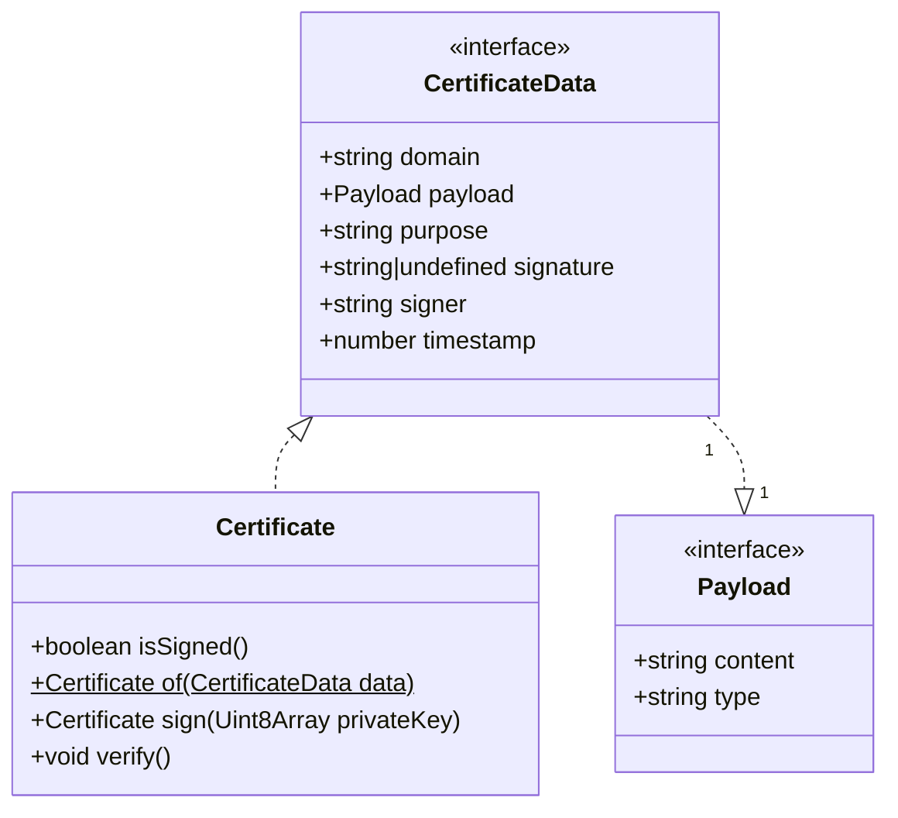

```mermaid
classDiagram
    class Certificate {
        +boolean isSigned()
        +Certificate of(CertificateData data)$
        +Certificate sign(Uint8Array privateKey)
        +void verify()
    }
    class CertificateData {
        <<interface>>
        +string domain
        +Payload payload
        +string purpose
        +string|undefined signature
        +string signer
        +number timestamp
    }
    class Payload {
        <<interface>>
        +string content
        +string type
    }
    CertificateData <|.. Certificate
    CertificateData "1" ..|> "1" Payload 
```
