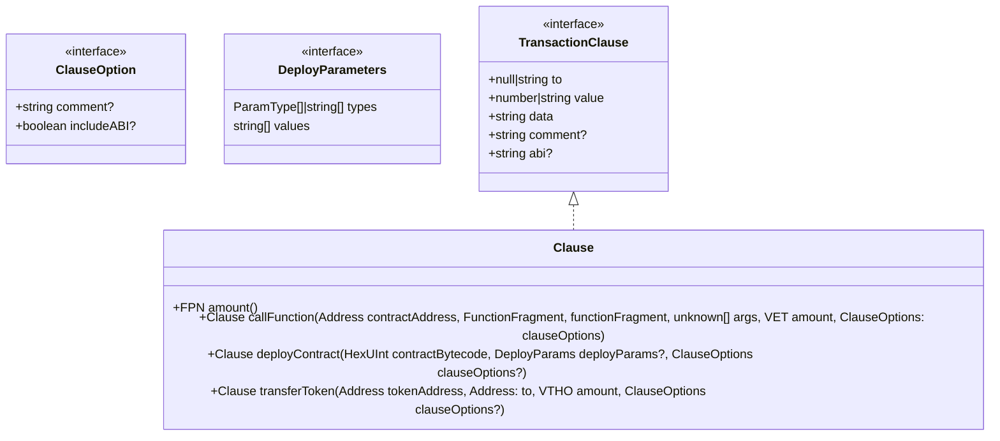

```mermaid
classDiagram
    class Clause {
        +FPN amount()
        +Clause callFunction(Address contractAddress, FunctionFragment, functionFragment, unknown[] args, VET amount, ClauseOptions: clauseOptions)
        +Clause deployContract(HexUInt contractBytecode, DeployParams deployParams?, ClauseOptions clauseOptions?)
        +Clause transferToken(Address tokenAddress, Address: to, VTHO amount, ClauseOptions clauseOptions?)
    }
    class ClauseOption{
        <<interface>>
        +string comment?
        +boolean includeABI?
    }
    class DeployParameters {
        <<interface>>
        ParamType[]|string[] types
        string[] values
    }
    class TransactionClause {
        <<interface>>
        +null|string to
        +number|string value
        +string data
        +string comment?
        +string abi?
    }
    TransactionClause <|.. Clause
```
