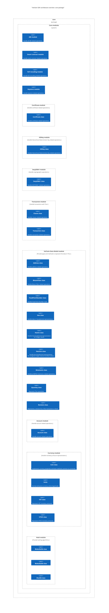

# Core Package C4 Architecture diagram
Main diagram for the `core package`.
It represents the architecture of the `core package` with its most important components.

```mermaid
C4Context
    title "Vechain SDK architecture overview: core package"

    Boundary(core, "core", "package") {
        Boundary(core_modules, "Core modules") {
            System(abi, "ABI module", "Handle all ABI related operations.")
            Boundary(certificate_module, "Certificate module", "Handle certificate related operations.") {
                System(Certificate, "Certificate class", "Handle certificate related operations.")
            }
            System(contract, "Smart contract module", "Handle smart contract related operations.")
            System(encoding, "RLP encoding module", "Handle RLP encoding related operations.")
            Boundary(hdkey, "HDKey module", "Handle Hierarchical Deterministic Key related operations.") {
                System(KDKey, "HDKey class", "Handle Hierarchical Deterministic Key related operations.")
            }
            System(keystore, "Keystore module", "Handle keystore related operations.")
            Boundary(secp256k1, "Secp256k1 module", "Handle cryprographic operations.") {
                System(Secp256k1, "Secp256k1 class", "Handle SECP256K1 related operations.")
            }
            Boundary(transaction, "Transaction module", "Handle transactions with Thor.") {
                System(Clause, "Clause class", "Handles clause related operations.")
                System(Transaction, "Transaction class", "Handle transaction related operations.")
            }
            Boundary(vcdm, "VeChain Data Model module", "Provide types and methods to represent the data in Thor.") {
                Boundary(account, "Account module", "Handle account related operations.") {
                    System(Account, "Account class", "Handle account related operations.")    
                }
                System(Address, "Address class", "Handle address related operations.")
                System(BloomFilter, "BloomFilter class", "Handle Bloom filter related operations.")
                Boundary(currency, "Currency module", "Handle monetary amount representation.") {
                    System(Coin, "Coin class", "Implements currency properties and base methods common to currencies.")
                    System(Units, "Units", "Format and parse currency units (magnitude).")
                    System(VET, "VET class", "Represent VET monetary amounts.")
                    System(VTHO, "VTHO class", "Represent VTHO monetary amounts.")
                }
                System(FixedPointNumber, "FixedPointNumber class", "Handle Fixed Point Number math.")
                Boundary(hash, "Hash module", "Provide hashing algorithms.") {
                    System(Blake2b256, "Blake2b256 class")
                    System(Keccak, "Blake2b256 class")
                    System(Sha256, "Sha256 class")
                }
                System(Hex, "Hex class", "Handle data in hexadecimal representation.")
                System(HexInt, "HexInt class", "Handle the hexadecimal representation<br>for integer values.")
                System(HexUInt, "HexUInt class", "Handle the hexadecimal representation<br>for unsigned integer (natural number) values.")
                System(Mnemonic, "Mnemonic class", "Handle all BIP32 mnemonic related operations.")
                System(Quantity, "Quantity class", "Represent Thor quantities.")
                System(Revision, "Revision class", "Represents a revision for a Thor transaction or block.")
            }
        }
 }

    UpdateLayoutConfig($c4ShapeInRow="2", $c4BoundaryInRow="1")
```
