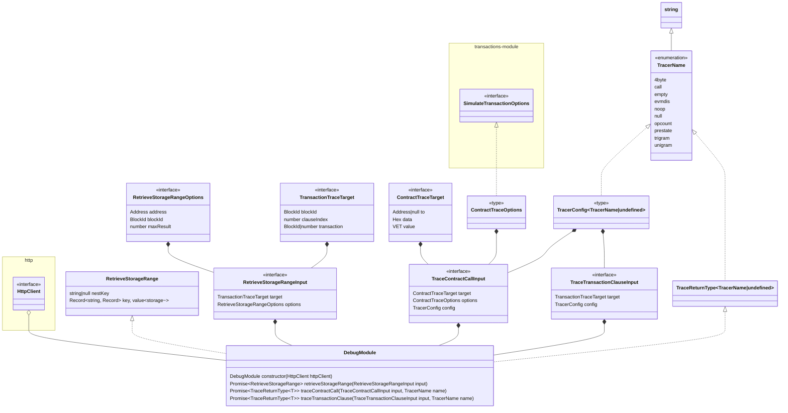

```mermaid
classDiagram
    class ContractTraceTarget {
        <<interface>>
        Address|null to
        Hex data
        VET value
    }
    class ContractTraceOptions {
        <<type>>
    }
    class DebugModule {
        DebugModule constructor(HttpClient httpClient)
        Promise~RetrieveStorageRange~ retrieveStorageRange(RetrieveStorageRangeInput input)
        Promise~TraceReturnType~T~~ traceContractCall(TraceContractCallInput input, TracerName name)
        Promise~TraceReturnType~T~~ traceTransactionClause(TraceTransactionClauseInput input, TracerName name)
    }
    namespace http {
        class HttpClient {
            <<interface>>
        }
    }
    class RetrieveStorageRange {
        string|null nestKey
        Record~string, Record~ key, value~storage~~
    }
    class RetrieveStorageRangeInput {
        <<interface>>
        TransactionTraceTarget target
        RetrieveStorageRangeOptions options
    }
    class RetrieveStorageRangeOptions {
        <<interface>>
        Address address
        BlockId blockId
        number maxResult
    }
    class TraceContractCallInput {
        <<interface>>
        ContractTraceTarget target
        ContractTraceOptions options
        TracerConfig config
    }
    class TraceTransactionClauseInput {
        <<interface>>
        TransactionTraceTarget target
        TracerConfig config
    }
    class TraceReturnType~TracerName|undefined~
    namespace transactions-module {
        class SimulateTransactionOptions {
            <<interface>>
        }
    }
    class TracerConfig~TracerName|undefined~ {
        <<type>>
    }
    class TracerName {
        <<enumeration>>
        4byte
        call
        empty
        evmdis
        noop
        null
        opcount
        prestate
        trigram
        unigram
    }
    class TransactionTraceTarget {
        <<interface>>
        BlockId blockId
        number clauseIndex
        BlockId|number transaction
    }
    ContractTraceTarget *-- TraceContractCallInput
    ContractTraceOptions *-- TraceContractCallInput
    HttpClient o-- DebugModule
    RetrieveStorageRange <|.. DebugModule
    RetrieveStorageRangeInput *-- DebugModule
    RetrieveStorageRangeOptions *-- RetrieveStorageRangeInput
    string <|-- TracerName
    SimulateTransactionOptions <|.. ContractTraceOptions
    TraceContractCallInput *-- DebugModule
    TraceTransactionClauseInput *-- DebugModule
    TransactionTraceTarget *-- RetrieveStorageRangeInput
    TracerConfig *-- TraceContractCallInput
    TracerConfig *-- TraceTransactionClauseInput
    TracerName <|.. TracerConfig
    TracerName <|.. TraceReturnType
    TraceReturnType <|.. DebugModule
```
