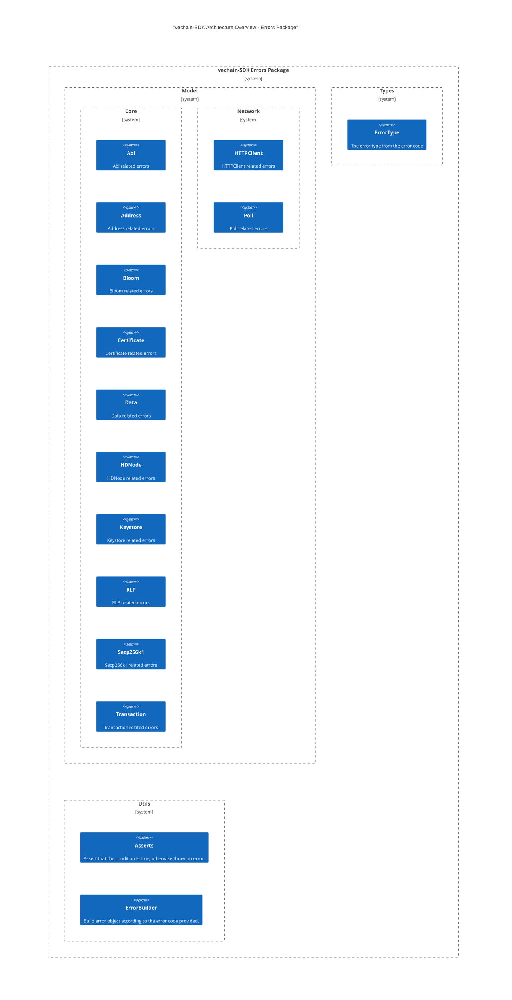

```mermaid
C4Context
    title "vechain-SDK Architecture Overview - Errors Package"

    Boundary(b0, "vechain-SDK Errors Package") {
        Boundary(b1, "Model") {
            Boundary(b2, "Core") {
                System(abi, "Abi", "Abi related errors")
                System(address, "Address", "Address related errors")
                System(bloom, "Bloom", "Bloom related errors")
                System(certificate, "Certificate", "Certificate related errors")
                System(data, "Data", "Data related errors")
                System(hdnode, "HDNode", "HDNode related errors")
                System(keystore, "Keystore", "Keystore related errors")
                System(rlp, "RLP", "RLP related errors")
                System(secp256k1, "Secp256k1", "Secp256k1 related errors")
                System(transaction, "Transaction", "Transaction related errors")
            }

            Boundary(b3, "Network") {
                System(http-client, "HTTPClient", "HTTPClient related errors")
                System(poll, "Poll", "Poll related errors")
            }
        }

        Boundary(b4, "Types") {
            System(error-type, "ErrorType", "The error type from the error code")
        }

        Boundary(b5, "Utils") {
            System(asserts, "Asserts", "Assert that the condition is true, otherwise throw an error.")
            System(error-builder, "ErrorBuilder", "Build error object according to the error code provided.")
        }
    }
```