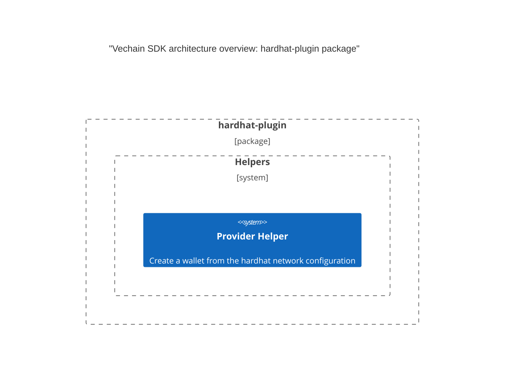

# Hardhat Plugin Package C4 Architecture diagram
Main diagram for the `hardhat-plugin package`.
It represents the architecture of the `hardhat-plugin package` with its most important components.

```mermaid
C4Context
    title "Vechain SDK architecture overview: hardhat-plugin package"

    Boundary(b0, "hardhat-plugin", "package") {
        Boundary(b1, "Helpers") {
            System(provider-helper, "Provider Helper", "Create a wallet from the hardhat network configuration")
        }
    }
```