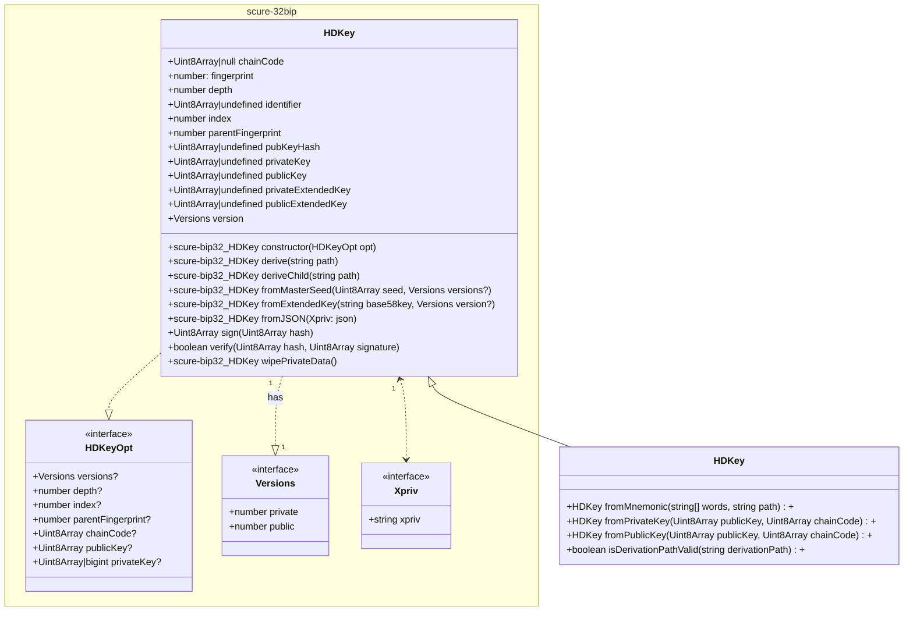

```mermaid
classDiagram
    namespace scure-32bip {
        class scure-bip32_HDKey["HDKey"] {
            +Uint8Array|null chainCode
            +number: fingerprint
            +number depth
            +Uint8Array|undefined identifier
            +number index
            +number parentFingerprint
            +Uint8Array|undefined pubKeyHash
            +Uint8Array|undefined privateKey
            +Uint8Array|undefined publicKey
            +Uint8Array|undefined privateExtendedKey
            +Uint8Array|undefined publicExtendedKey
            +Versions version
            +scure-bip32_HDKey constructor(HDKeyOpt opt)
            +scure-bip32_HDKey derive(string path)
            +scure-bip32_HDKey deriveChild(string path)
            +scure-bip32_HDKey fromMasterSeed(Uint8Array seed, Versions versions?)
            +scure-bip32_HDKey fromExtendedKey(string base58key, Versions version?)
            +scure-bip32_HDKey fromJSON(Xpriv: json)
            +Uint8Array sign(Uint8Array hash)
            +boolean verify(Uint8Array hash, Uint8Array signature)
            +scure-bip32_HDKey wipePrivateData()
        }
        class HDKeyOpt {
            <<interface>>
            +Versions versions?
            +number depth?
            +number index?
            +number parentFingerprint?
            +Uint8Array chainCode?
            +Uint8Array publicKey?
            +Uint8Array|bigint privateKey?
        }
        class Versions {
            <<interface>>
            +number private
            +number public
        }
        class Xpriv {
            <<interface>>
            +string xpriv
        }
    }
    class HDKey {
        +HDKey fromMnemonic(string[] words, string path)+
        +HDKey fromPrivateKey(Uint8Array publicKey, Uint8Array chainCode)+
        +HDKey fromPublicKey(Uint8Array publicKey, Uint8Array chainCode)+
        +boolean isDerivationPathValid(string derivationPath)+
    }
    scure-bip32_HDKey <|-- HDKey
    scure-bip32_HDKey "1" ..|> "1" Versions : has
    scure-bip32_HDKey ..|> HDKeyOpt
    scure-bip32_HDKey "1" <..> Xpriv
```
