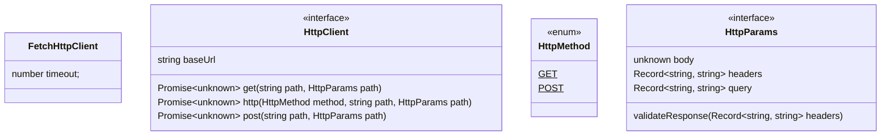

```mermaid
classDiagram
    class FetchHttpClient {
        number timeout;
    }
    class HttpClient {
        <<interface>>
        string baseUrl
        Promise~unknown~ get(string path, HttpParams path)
        Promise~unknown~ http(HttpMethod method, string path, HttpParams path)
        Promise~unknown~ post(string path, HttpParams path)
        
    }
    class HttpMethod {
        <<enum>>
        GET$
        POST$
    }
    class HttpParams {
        <<interface>>
        unknown body
        Record~string, string~ headers
        Record~string, string~ query
        validateResponse(Record~string, string~ headers)
    }

```
