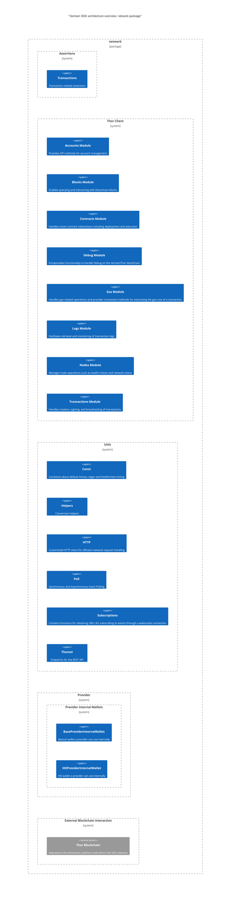

# Network Package C4 Architecture diagram
Main diagram for the `network package`.
It represents the architecture of the `network package` with its most important components.

```mermaid
C4Context
    title "Vechain SDK architecture overview: network package"

    Boundary(b0, "network", "package") {
        Boundary(b1, "Assertions") {
            System(transactions, "Transactions", "Transaction related assertions")
        }

        Boundary(b2, "Thor Client") {
            System(accounts_module, "Accounts Module", "Provides API methods for account management")
            System(blocks_module, "Blocks Module", "Enables querying and interacting with blockchain blocks")
            System(contracts_module, "Contracts Module", "Handles smart contract interactions including deployment and execution")
            System(debug_module, "Debug Module", "Encapsulates functionality to handle Debug on the VechainThor blockchain")
            System(gas_module, "Gas Module", "Handles gas related operations and provides convenient methods for estimating the gas cost of a transaction")
            System(logs_module, "Logs Module", "Facilitates retrieval and monitoring of transaction logs")
            System(nodes_module, "Nodes Module", "Manages node operations such as health checks and network status")
            System(transactions_module, "Transactions Module", "Handles creation, signing, and broadcasting of transactions")
        }

        Boundary(b3, "Utils") {
            System(const, "Const", "Constants about default timout, regex and healthcheck timing")
            System(helpers, "Helpers", "Conversion helpers")
            System(http, "HTTP", "Customized HTTP client for efficient network request handling")
            System(poll, "Poll", "Synchronous and Asynchronous Event Polling")
            System(subscriptions, "Subscriptions", "Contains functions for obtaining URLs for subscribing to events through a websocket connection")
            System(thorest, "Thorest", "Endpoints for the REST API")
        }
       
        Boundary(b4, "Provider") {
            Boundary(b41, "Provider Internal Wallets") {
                System(provider-internal-base-wallet, "BaseProviderInternalWallet", "Basical wallet a provider can use internally")
                System(provider-internal-hd-wallet, "HDProviderInternalWallet", "HD wallet a provider can use internally")
            }        
        }
        
        Boundary(b5, "External Blockchain Interaction") {
            System_Ext(vechainthor, "Thor Blockchain", "Represents the blockchain platform with which the SDK interacts")
        }
       
    }

    UpdateLayoutConfig($c4ShapeInRow="3", $c4BoundaryInRow="1")
```