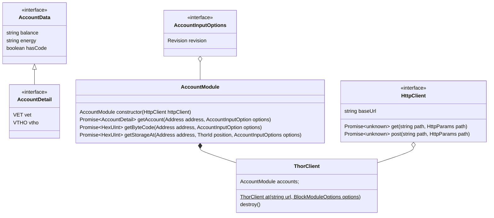

```mermaid
classDiagram
    class AccountData {
        <<interface>>
        string balance
        string energy
        boolean hasCode
    }
    class AccountDetail {
        <<interface>>
        VET vet
        VTHO vtho
    }
    class AccountInputOptions {
        <<interface>>
        Revision revision
    }
    class AccountModule {
        AccountModule constructor(HttpClient httpClient)
        Promise~AccountDetail~ getAccount(Address address, AccountInputOption options)
        Promise~HexUInt~ getByteCode(Address address, AccountInputOption options)
        Promise~HexUInt~ getStorageAt(Address address, ThorId position, AccountInputOptions options)
    }
    class HttpClient {
        <<interface>>
        string baseUrl
        Promise~unknown~ get(string path, HttpParams path)
        Promise~unknown~ post(string path, HttpParams path)
    }
    class ThorClient {
        AccountModule accounts;
        ThorClient at(string url, BlockModuleOptions options)$
        destroy()
    }
    AccountData <|-- AccountDetail
    AccountInputOptions o-- AccountModule
    AccountModule *-- ThorClient
    HttpClient o-- ThorClient
```
