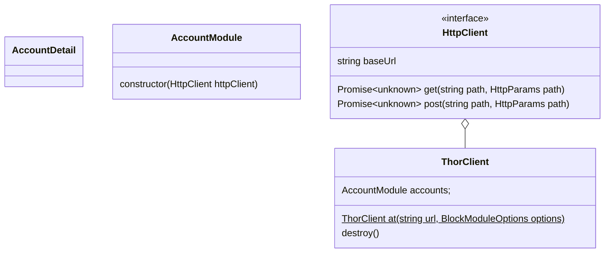

```mermaid
classDiagram
    class AccountDetail {
        
    }
    class AccountModule {
        constructor(HttpClient httpClient)
    }
    class HttpClient {
        <<interface>>
        string baseUrl
        Promise~unknown~ get(string path, HttpParams path)
        Promise~unknown~ post(string path, HttpParams path)
    }
    class ThorClient {
        AccountModule accounts;
        ThorClient at(string url, BlockModuleOptions options)$
        destroy()
    }
    HttpClient o-- ThorClient
    
```
