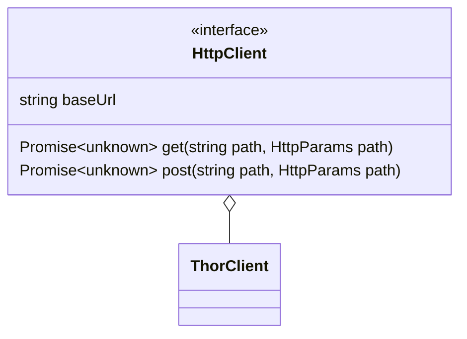

```mermaid
classDiagram
    class HttpClient {
        <<interface>>
        string baseUrl
        Promise~unknown~ get(string path, HttpParams path)
        Promise~unknown~ post(string path, HttpParams path)
    }
    class ThorClient {
    }
    HttpClient o-- ThorClient
```
