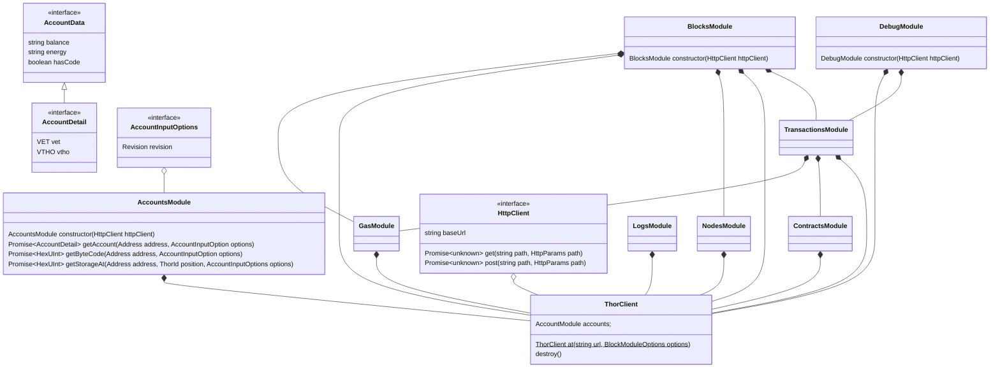

```mermaid
classDiagram
    class AccountData {
        <<interface>>
        string balance
        string energy
        boolean hasCode
    }
    class AccountDetail {
        <<interface>>
        VET vet
        VTHO vtho
    }
    class AccountInputOptions {
        <<interface>>
        Revision revision
    }
    class AccountsModule {
        AccountsModule constructor(HttpClient httpClient)
        Promise~AccountDetail~ getAccount(Address address, AccountInputOption options)
        Promise~HexUInt~ getByteCode(Address address, AccountInputOption options)
        Promise~HexUInt~ getStorageAt(Address address, ThorId position, AccountInputOptions options)
    }
    class BlocksModule {
        BlocksModule constructor(HttpClient httpClient)
    }
    class ContractsModule {
    }
    class DebugModule {
        DebugModule constructor(HttpClient httpClient)
    }
    class GasModule {
    }
    class HttpClient {
        <<interface>>
        string baseUrl
        Promise~unknown~ get(string path, HttpParams path)
        Promise~unknown~ post(string path, HttpParams path)
    }
    class LogsModule {
    }
    class NodesModule {
    }
    class ThorClient {
        AccountModule accounts;
        ThorClient at(string url, BlockModuleOptions options)$
        destroy()
    }
    class TransactionsModule {
    }
    AccountData <|-- AccountDetail
    AccountInputOptions o-- AccountsModule
    AccountsModule *-- ThorClient
    BlocksModule *-- GasModule
    BlocksModule *-- ThorClient
    BlocksModule *-- NodesModule
    BlocksModule *-- ThorClient
    BlocksModule *-- TransactionsModule
    ContractsModule *-- ThorClient
    DebugModule *-- ThorClient
    DebugModule *-- TransactionsModule
    GasModule *-- ThorClient
    HttpClient o-- ThorClient
    LogsModule *-- ThorClient
    NodesModule *-- ThorClient
    TransactionsModule *-- GasModule
    TransactionsModule *-- ContractsModule
    TransactionsModule *-- ThorClient
```
