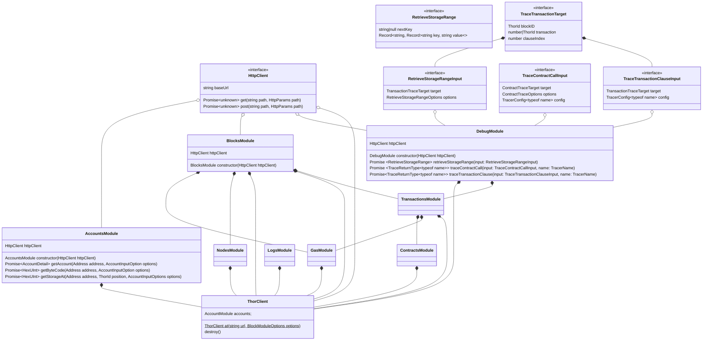

```mermaid
classDiagram
    class AccountsModule {
        HttpClient httpClient
        AccountsModule constructor(HttpClient httpClient)
        Promise~AccountDetail~ getAccount(Address address, AccountInputOption options)
        Promise~HexUInt~ getByteCode(Address address, AccountInputOption options)
        Promise~HexUInt~ getStorageAt(Address address, ThorId position, AccountInputOptions options)
    }
    class BlocksModule {
        HttpClient httpClient
        BlocksModule constructor(HttpClient httpClient)
    }
    class ContractsModule {
    }
    class DebugModule {
        HttpClient httpClient
        DebugModule constructor(HttpClient httpClient)
        Promise ~RetrieveStorageRange~ retrieveStorageRange(input: RetrieveStorageRangeInput)
        Promise ~TraceReturnType~typeof name~~ traceContractCall(input: TraceContractCallInput, name: TracerName)
        Promise~TraceReturnType~typeof name~~ traceTransactionClause(input: TraceTransactionClauseInput, name: TracerName)
    }
    class GasModule {
    }
    class HttpClient {
        <<interface>>
        string baseUrl
        Promise~unknown~ get(string path, HttpParams path)
        Promise~unknown~ post(string path, HttpParams path)
    }
    class LogsModule {
    }
    class NodesModule {
    }
    class RetrieveStorageRangeInput {
        <<interface>>
        TransactionTraceTarget target
        RetrieveStorageRangeOptions options
    }
    class RetrieveStorageRange {
        <<interface>>
        string|null nextKey
        Record~string, Record~string key, string value~~
    }
    class ThorClient {
        AccountModule accounts;
        ThorClient at(string url, BlockModuleOptions options)$
        destroy()
    }
    class TraceContractCallInput {
        <<interface>>
        ContractTraceTarget target
        ContractTraceOptions options
        TracerConfig~typeof name~ config
    }
    class TraceTransactionClauseInput {
        <<interface>>
        TransactionTraceTarget target
        TracerConfig~typeof name~ config
    }
    class TraceTransactionTarget {
        <<interface>>
        ThorId blockID
        number|ThorId transaction
        number clauseIndex
    }
    class TransactionsModule {
    }
    AccountsModule *-- ThorClient
    BlocksModule *-- GasModule
    BlocksModule *-- NodesModule
    BlocksModule *-- ThorClient
    BlocksModule *-- ThorClient
    BlocksModule *-- TransactionsModule
    ContractsModule *-- ThorClient
    DebugModule *-- ThorClient
    DebugModule *-- TransactionsModule
    GasModule *-- ThorClient
    HttpClient o-- AccountsModule
    HttpClient o-- BlocksModule
    HttpClient o-- DebugModule
    HttpClient o-- ThorClient
    LogsModule *-- ThorClient
    NodesModule *-- ThorClient
    RetrieveStorageRangeInput o-- DebugModule
    TraceContractCallInput o-- DebugModule
    TraceTransactionClauseInput o-- DebugModule
    TraceTransactionTarget *-- RetrieveStorageRangeInput
    TraceTransactionTarget *-- TraceTransactionClauseInput
    TransactionsModule *-- ContractsModule
    TransactionsModule *-- GasModule
    TransactionsModule *-- ThorClient
```
