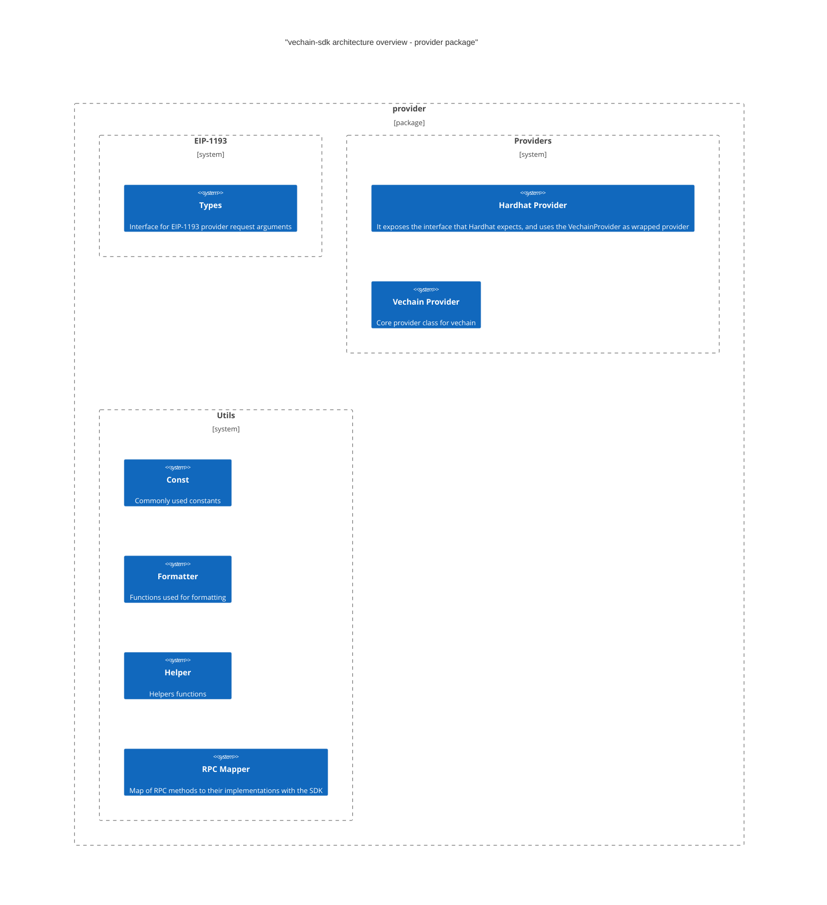

# Provider Package C4 Architecture diagram
Main diagram for the provider package.
It represents the architecture of the provider package with its most important components.

```mermaid
C4Context
    title "vechain-sdk architecture overview - provider package"

    Boundary(b0, "provider", "package") {
        Boundary(b1, "EIP-1193") {
            System(types, "Types", "Interface for EIP-1193 provider request arguments")
        }

        Boundary(b2, "Providers") {
            System(hardhat-provider, "Hardhat Provider", "It exposes the interface that Hardhat expects, and uses the VechainProvider as wrapped provider")
            System(vechain-provider, "Vechain Provider", "Core provider class for vechain")
        }

        Boundary(b3, "Utils") {
            System(const, "Const", "Commonly used constants")
            System(formatter, "Formatter", "Functions used for formatting")
            System(helper, "Helper", "Helpers functions")
            System(rpc-mapper, "RPC Mapper", "Map of RPC methods to their implementations with the SDK")
        }
    }
```