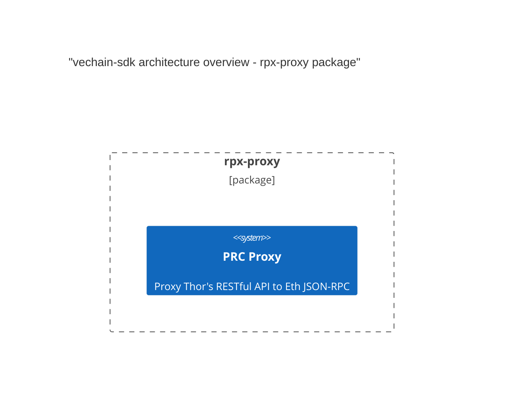

# RPC Proxy Package C4 Architecture diagram
Main diagram for the rpx-proxy package.
It represents the architecture of the rpx-proxy package with its most important components.

```mermaid
C4Context
    title "vechain-sdk architecture overview - rpx-proxy package"

    Boundary(b0, "rpx-proxy", "package") {
        System(rpx-proxy, "PRC Proxy", "Proxy Thor's RESTful API to Eth JSON-RPC")
    }
```