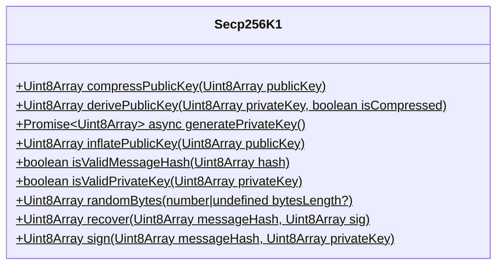

```mermaid
classDiagram
    class Secp256K1 {
        +Uint8Array compressPublicKey(Uint8Array publicKey)$
        +Uint8Array derivePublicKey(Uint8Array privateKey, boolean isCompressed)$
        +Promise~Uint8Array~ async generatePrivateKey()$
        +Uint8Array inflatePublicKey(Uint8Array publicKey)$
        +boolean isValidMessageHash(Uint8Array hash)$
        +boolean isValidPrivateKey(Uint8Array privateKey)$
        +Uint8Array randomBytes(number|undefined bytesLength?)$
        +Uint8Array recover(Uint8Array messageHash, Uint8Array sig)$
        +Uint8Array sign(Uint8Array messageHash, Uint8Array privateKey)$
 }
```
