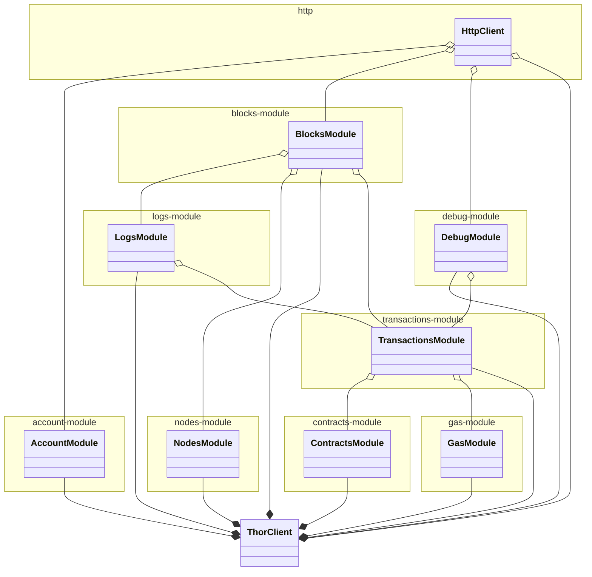

```mermaid
classDiagram
    namespace http {
        class HttpClient
    }
    namespace account-module {
        class AccountModule
    }
    namespace blocks-module {
        class BlocksModule
    }
    namespace contracts-module {
        class ContractsModule
    }
    namespace debug-module {
        class DebugModule
    }
    namespace gas-module {
        class GasModule
    }
    namespace logs-module {
        class LogsModule
    }
    namespace nodes-module {
        class NodesModule
    }
    namespace transactions-module {
        class TransactionsModule
    }
    class ThorClient
    AccountModule --* ThorClient
    BlocksModule o-- LogsModule
    BlocksModule o-- NodesModule
    BlocksModule --* ThorClient
    BlocksModule o-- TransactionsModule
    ContractsModule --* ThorClient
    DebugModule --* ThorClient
    DebugModule o-- TransactionsModule
    GasModule --* ThorClient
    HttpClient o-- AccountModule
    HttpClient o-- BlocksModule
    HttpClient o-- DebugModule
    HttpClient o-- ThorClient
    LogsModule --* ThorClient
    LogsModule o-- TransactionsModule
    NodesModule --* ThorClient
    TransactionsModule o-- ContractsModule
    TransactionsModule o-- GasModule
    TransactionsModule --* ThorClient
```
