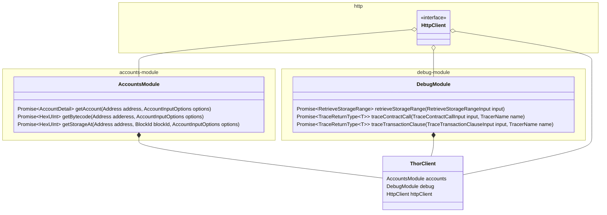

```mermaid
classDiagram
    namespace accounts-module {
        class AccountsModule {
            Promise~AccountDetail~ getAccount(Address address, AccountInputOptions options)
            Promise~HexUInt~ getBytecode(Address adderess, AccountInputOptions options)
            Promise~HexUInt~ getStorageAt(Address address, BlockId blockId, AccountInputOptions options)
        }
    }
    namespace debug-module {
        class DebugModule {
            Promise~RetrieveStorageRange~ retrieveStorageRange(RetrieveStorageRangeInput input)
            Promise~TraceReturnType~T~~ traceContractCall(TraceContractCallInput input, TracerName name)
            Promise~TraceReturnType~T~~ traceTransactionClause(TraceTransactionClauseInput input, TracerName name)
        }
    }
    namespace http {
        class HttpClient {
            <<interface>>
        }
    }
    class ThorClient {
        AccountsModule accounts
        DebugModule debug
        HttpClient httpClient
        
    }
    AccountsModule *-- ThorClient
    DebugModule *-- ThorClient
    HttpClient o-- AccountsModule
    HttpClient o-- DebugModule
    HttpClient o-- ThorClient
```
