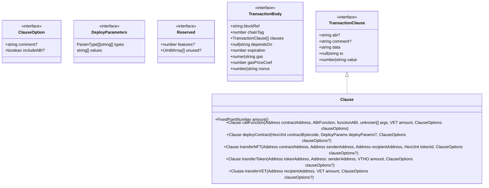

```mermaid
classDiagram
    class Clause {
        +FixedPointNumber amount()
        +Clause callFunction(Address contractAddress, ABIFunction, functionABI, unknown[] args, VET amount, ClauseOptions: clauseOptions)
        +Clause deployContract(HexUInt contractBytecode, DeployParams deployParams?, ClauseOptions clauseOptions?)
        +Clause transferNFT(Address contractAddress, Address senderAddress, Address recipientAddress, HexUInt tokenId, ClauseOptions clauseOptions?)
        +Clause transferToken(Address tokenAddress, Address: senderAddress, VTHO amount, ClauseOptions clauseOptions?)
        +Cluase transferVET(Address recipientAddress, VET amount, ClauseOptions clauseOptions?)
    }
    class ClauseOption{
        <<interface>>
        +string comment?
        +boolean includeABI?
    }
    class DeployParameters {
        <<interface>>
        ParamType[]|string[] types
        string[] values
    }
    class Reserved {
        <<interface>>
        +number features?
        +UInt8Array[] unused?
    }
    class TransactionBody {
        <<interface>>
        +string blockRef
        +number chainTag
        +TransactionClause[] clauses
        +null|string dependsOn
        +number expiration
        +numer|string gas
        +number gasPriceCoef
        +number|string nonce
    }
    class TransactionClause {
        <<interface>>
        +string abi?
        +string comment?
        +string data
        +null|string to
        +number|string value
    }
    TransactionClause <|.. Clause
```
