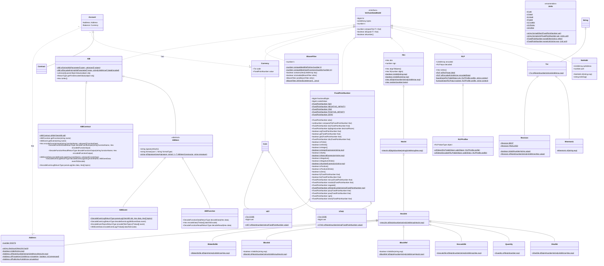

```mermaid
classDiagram
    class ABI {
        +ABI of(string|AbiParameter[] types, unknown[] values)$
        +ABI ofEncoded(string|AbiParameter[] types, string|Uint8Array[] dataEncoded)$
        +unknown[] parseObjectValues(object obj)
        +ReturnType getFirstDecodedValue<ReturnType>(object obj)
        +Hex toHex()
    }
    class ABIContract {
        +ABIContract ofAbi(ViemABI abi)$
        +ABIFunction getFunction(string name)
        +ABIEvent getEvent(string name)
        +Hex encodeFunctionInput(string functionName, unknown[] functionData)
        +DecodeFunctionDataReturnType decodeFunctionInput(string functionName, Hex encodedFunctionInput)
        +DecodeFunctionResultReturnType decodeFunctionOutput(string functionName, Hex encodedFunctionOutput)
        +ABIEventData encodeEventLog(string eventName, unknown[] eventArgs)
        +DecodeEventLogReturnType decodeEventLog(string eventName, ABIEventData eventToDecode)
        +DecodeEventLogReturnType parseLog(Hex data, Hex[] topics)
    }
    class ABIEvent {
        +DecodeEventLogReturnType parseLog(ViemABI abi, Hex data, Hex[] topics)$
        +DecodeEventLogReturnType decodeEventLog(ABIEventData event)
        +EncodeEventTopicsReturnType encodeFilterTopics<TValue>(TValue[] event)
        +ABIEventData encodeEventLog<TValue>(TValue[] dataToEncode)
    }
    class ABIFunction {
        +DecodeFunctionDataReturnType decodeData(Hex data)
        +Hex encodeData<TValue>(TValue[] dataToEncode)
        +DecodeFunctionResultReturnType decodeResult(Hex data)
    }
    class ABIItem {
        <<abstract>>
        +string signatureHash()
        +string format('json' | 'string' formatType)
        +string ofSignature(new(signature: string) => T ABIItemConstructor, string signature)$
    }
    class Account {
        #address: Address
        #balance: Currency
    }
    class Address {
        +number DIGITS$
        +string checksum(HexUInt huint)$
        +boolean isValid(string exp)$
        +Address of(bigint|number|string|Uint8Array|HexUInt exp)$
        +Address ofPrivateKey(Uint8Array privateKey, boolean: isCompressed)$
        +Address ofPublicKey(Uint8Array privateKey)$
    }
    class Blake2b256 {
        +Blake2b256 of(bigint|string|Uint8Array|Hex exp)$
    }
    class BlockId {
        +boolean isValid0x(string exp)
        +BlockId of(bigint|number|string|Uint8Array|HexInt exp)$
    }
    class BlockRef {
        +boolean isValid0x(string exp)
        +BlockRef of(bigint|number|string|Uint8Array|HexInt exp)$
    }
    class BloomFilter {
        +number k
        +number computeBestBitsPerKey(number k)$
        +number computeBestHashFunctionsQuantity(number m)$
        +boolean contains(Hex|Uint8Array key)
        +boolean isJoinable(BloomFilter other)
        +BloomFilter join(BloomFilter other)
        +BloomFilter of(Hex[]|Uint8Array[] ...keys)$
    }
    class Coin
    class Contract
    class Currency {
        +Txt code
        +FixedPointNumber value
    }
    class FixedPointNumber {
        +bigint fractionalDigits
        +bigint scaledValue
        +FixedPointNumber NaN$
        +FixedPointNumber NEGATIVE_INFINITY$
        +FixedPointNumber ONE$
        +FixedPointNumber POSITIVE_INFINITY$
        +FixedPointNumber ZERO$
        +FixedPointNumber abs()
        +null|number comparedTo(FixedPointNumber that)
        +FixedPointNumber div(FixedPointNumber that)
        +FixedPointNumber dp(bigint|number decimalPlaces)
        +boolean eq(FixedPointNumber that)
        +boolean gt(FixedPointNumber that)
        +boolean gte(FixedPointNumber that)
        +FixedPointNumber idiv(FixedPointNumber that)
        +boolean isFinite()
        +boolean isInfinite()
        +boolean isInteger()
        +boolean isIntegerExpression(string exp)$
        +boolean isNaN()
        +boolean isNaturalExpression(string exp)$
        +boolean isNegative()
        +boolean isNegativeInfinite()
        +boolean isNumberExpression(string exp)$
        +boolean isPositive()
        +boolean isPositiveInfinite()
        +boolean isZero()
        +boolean lt(FixedPointNumber that)
        +boolean lte(FixedPointNumber that)
        +FixedPointNumber minus(FixedPointNumber that)
        +FixedPointNumber modulo(FixedPointNumber that)
        +FixedPointNumber negated()
        +FixedPointNumber of(bigint|number|string|FixedPointNumber exp)$
        +FixedPointNumber plus(FixedPointNumber that)
        +FixedPointNumber pow(FixedPointNumber that)
        +FixedPointNumber sqrt()
        +FixedPointNumber times(FixedPointNumber that)
    }
    class Hex {
        +Hex abs
        +number sign
        +Hex alignToBytes()
        +Hex fit(number digits)
        +boolean isValid(string exp)$
        +boolean isValid0x(string exp)$
        +Hex of(bigint|number|string|Uint8Array exp)$
        +Hex random(number bytes)$
    }
    class HexInt {
        +HexInt of(bigint|number|string|Uint8Array|Hex exp)$
    }
    class HexUInt {
        +HexUInt of(bigint|number|string|Uint8Array|HexInt exp)$
    }
    class Keccak256 {
        +Keccak256 of(bigint|number|string|Uint8Array|Hex exp)$
    }
    class Mnemonic {
        +Mnemonic of(string exp)$
    }
    class Quantity {
        +Quantity of(bigint|number exp)$
    }
    class Revision {
        +Revision BEST$
        +Revision FINALIZED$
        +boolean isValid(number|string value)$
        +Revision of(bigint|number|string|Uint8Array|Hex value)$
    }
    class RLP {
        +Uint8Array encoded
        +RLPInput decoded
        +Hex toHex()
        +RLP of(RLPInput data)$
        +RLP ofEncoded(Uint8Array encodedData)$
        #packData(RLPValidObject obj, RLPProfile profile, string context)$
        #unpackData(RLPInput packed, RLPProfile profile, string context)$
    }
    class RLPProfiler {
        +RLPValueType object
        +ofObject(RLPValidObject validObject, RLPProfile profile)$
        +ofObjectEncoded(RLPValidObject validObject, RLPProfile profile)$
    }
    class Sha256 {
        +Sha256 of(bigint|number|string|Uint8Array|Hex exp)$
    }
    class String
    class Txt {
        +Txt of(bigint|number|string|Uint8Array exp)$
    }
    class Units {
        <<enumeration>>
        +0 wei$
        +3 kwei$
        +6 mwei$
        +9 gwei$
        +12 szabo$
        +15 finney$
        +18 ether$
        +string formatEther(FixedPointNumber wei)$
        +string formatUnit(FixedPointNumber wei, Units unit)$
        +FixedPointNumber parseEther(string: ether)$
        +FixedPointNumber parseUnit(string exp, Unit unit)$
    }
    class NetAddr {
        +Uint8Array ipAddress
        +number port
        +NetAddr of(string exp)
        +string toString() 
    }
    class VeChainDataModel {
        <<interface>>
        +bigint bi
        +Uint8Array bytes
        +number n
        +number compareTo(~T~ that)
        +boolean isEqual(~T~ that)
        +boolean isNumber()
    }
    class VET {
        +Txt CODE$
        +bigint wei
        +VET of(bigint|number|string|FixedPointNumber value)$
    }
    class VTHO {
        +Txt CODE$
        +bigint wei
        +VTHO of(bigint|number|string|FixedPointNumber value)$
    }
    ABI <|-- ABIContract
    ABI <|-- ABIItem
    ABIItem <|-- ABIEvent
    ABIItem <|-- ABIFunction
    Account "1" ..|> "1" Address: has
    Account "1" ..|> "1" Currency: has
    Account <|-- Contract
    Coin <|-- VET
    Coin <|-- VTHO
    Currency <|.. Coin
    FixedPointNumber <|-- VET
    FixedPointNumber <|-- VTHO
    Hex <|-- HexInt
    HexInt <|-- HexUInt
    HexUInt <|-- Address
    HexUInt <|-- Blake2b256
    HexUInt <|-- BlockId
    HexUInt <|-- BlockRef
    HexUInt <|-- Keccak256
    HexUInt <|-- Quantity
    HexUInt <|-- Sha256
    RLP <|-- RLPProfiler
    String <|-- Txt
    Txt <|-- Revision
    Txt <|-- Mnemonic
    VeChainDataModel <|.. ABI
    VeChainDataModel <|.. BloomFilter
    VeChainDataModel <|.. Currency
    VeChainDataModel <|.. FixedPointNumber
    VeChainDataModel <|.. Hex
    VeChainDataModel <|.. RLP
    VeChainDataModel <|.. Txt
    VeChainDataModel <|.. NetAddr
```
