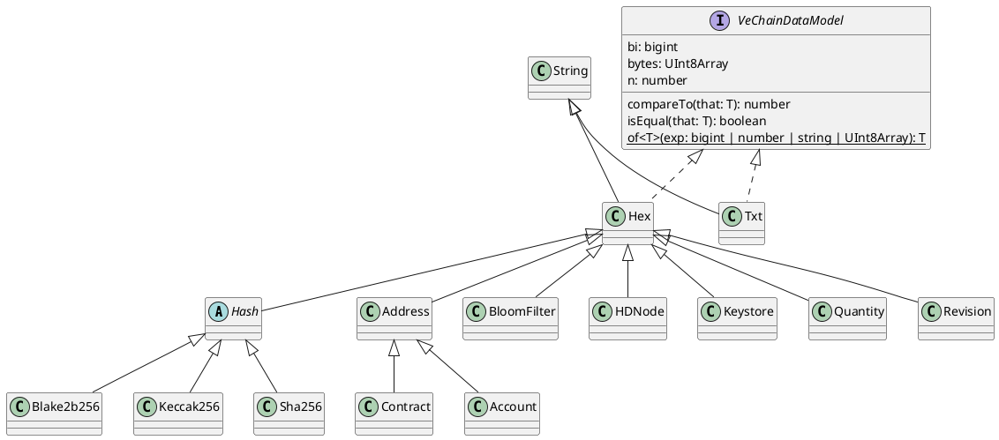

```plantuml
@startuml
abstract class Hash
class Account
class Address
class Blake2b256
class BloomFilter
class Contract
class HDNode
class Hex
class Keccak256
class Keystore
class Quantity
class Revision
class Sha256
class String
class Txt
interface VeChainDataModel {
    bi: bigint
    bytes: UInt8Array
    n: number
    compareTo(that: T): number
    isEqual(that: T): boolean
    {static} of<T>(exp: bigint | number | string | UInt8Array): T
}
Address <|-- Account
Address <|-- Contract
Hash <|-- Blake2b256
Hash <|-- Keccak256
Hash <|-- Sha256
Hex <|-- Address
Hex <|-- BloomFilter
Hex <|-- HDNode
Hex <|-- Hash
Hex <|-- Keystore
Hex <|-- Quantity
Hex <|-- Revision
VeChainDataModel <|.. Hex
VeChainDataModel <|.. Txt
String <|-- Hex
String <|-- Txt
@enduml
```
