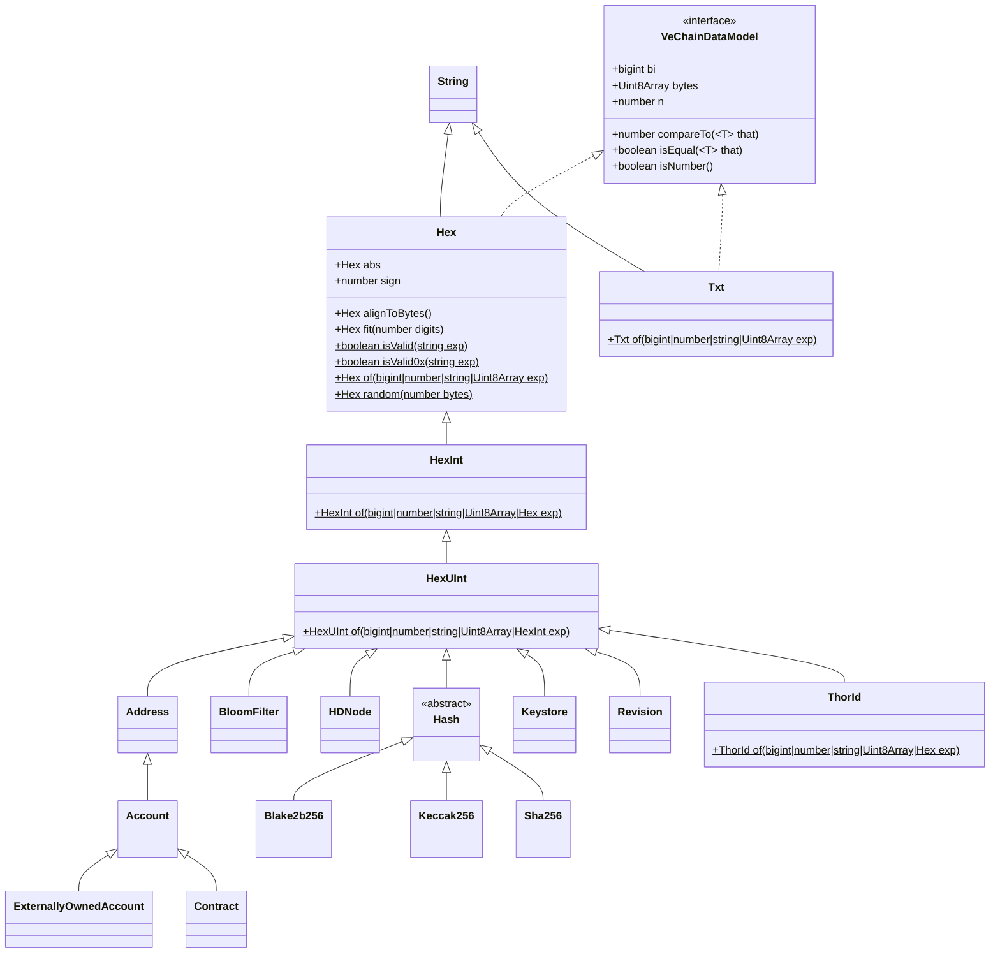

```mermaid
classDiagram
    class Account
    class Address
    class Blake2b256
    class BloomFilter
    class Contract
    class ExternallyOwnedAccount
    class HDNode
    class Hash {
        <<abstract>>
    }
    class Hex {
        +Hex abs
        +number sign
        +Hex alignToBytes()
        +Hex fit(number digits)
        +boolean isValid(string exp)$
        +boolean isValid0x(string exp)$
        +Hex of(bigint|number|string|Uint8Array exp)$
        +Hex random(number bytes)$
    }
    class HexInt {
        +HexInt of(bigint|number|string|Uint8Array|Hex exp)$
    }
    class HexUInt {
        +HexUInt of(bigint|number|string|Uint8Array|HexInt exp)$
    }
    class Keccak256 
    class Keystore
    class Revision
    class Sha256
    class String
    class ThorId {
        +ThorId of(bigint|number|string|Uint8Array|Hex exp)$
    }
    class Txt {
        +Txt of(bigint|number|string|Uint8Array exp)$
    }
    class String
    class VeChainDataModel{
        <<interface>>
      +bigint bi
      +Uint8Array bytes
      +number n
      +number compareTo(~T~ that)
      +boolean isEqual(~T~ that)
      +boolean isNumber()
    }
    Address <|-- Account
    Account <|-- ExternallyOwnedAccount
    Account <|-- Contract
    Hash <|-- Blake2b256
    Hash <|-- Keccak256
    Hash <|-- Sha256
    Hex <|-- HexInt
    HexUInt <|-- Address
    HexUInt <|-- BloomFilter
    HexUInt <|-- HDNode
    HexInt <|-- HexUInt
    HexUInt <|-- Hash
    HexUInt <|-- ThorId
    HexUInt <|-- Keystore
    HexUInt <|-- Revision
    String <|-- Hex
    String <|-- Txt
    VeChainDataModel <|.. Hex
    VeChainDataModel <|.. Txt
```
