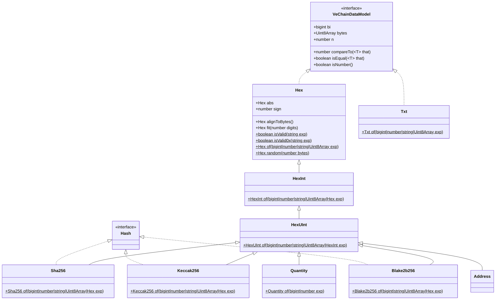

```mermaid
classDiagram
    class Address
    class Blake2b256 {
        +Blake2b256 of(bigint|string|Uint8Array|Hex exp)$
    }
    class Hash {
        <<interface>>
    }
    class Hex {
        +Hex abs
        +number sign
        +Hex alignToBytes()
        +Hex fit(number digits)
        +boolean isValid(string exp)$
        +boolean isValid0x(string exp)$
        +Hex of(bigint|number|string|Uint8Array exp)$
        +Hex random(number bytes)$
    }
    class HexInt {
        +HexInt of(bigint|number|string|Uint8Array|Hex exp)$
    }
    class HexUInt {
        +HexUInt of(bigint|number|string|Uint8Array|HexInt exp)$
    }
    class Keccak256 {
        +Keccak256 of(bigint|number|string|Uint8Array|Hex exp)$
    }
    class Quantity {
        +Quantity of(bigint|number exp)$
    }
    class Sha256 {
        +Sha256 of(bigint|number|string|Uint8Array|Hex exp)$
    }
    class Txt {
        +Txt of(bigint|number|string|Uint8Array exp)$
    }
    class VeChainDataModel{
        <<interface>>
      +bigint bi
      +Uint8Array bytes
      +number n
      +number compareTo(~T~ that)
      +boolean isEqual(~T~ that)
      +boolean isNumber()
    }
    Hash <|.. Blake2b256
    Hash <|.. Keccak256
    Hash <|.. Sha256
    Hex <|-- HexInt
    HexInt <|-- HexUInt
    HexUInt <|-- Address
    HexUInt <|-- Blake2b256
    HexUInt <|-- Keccak256
    HexUInt <|-- Quantity
    HexUInt <|-- Sha256
    VeChainDataModel <|.. Hex
    VeChainDataModel <|.. Txt
```
