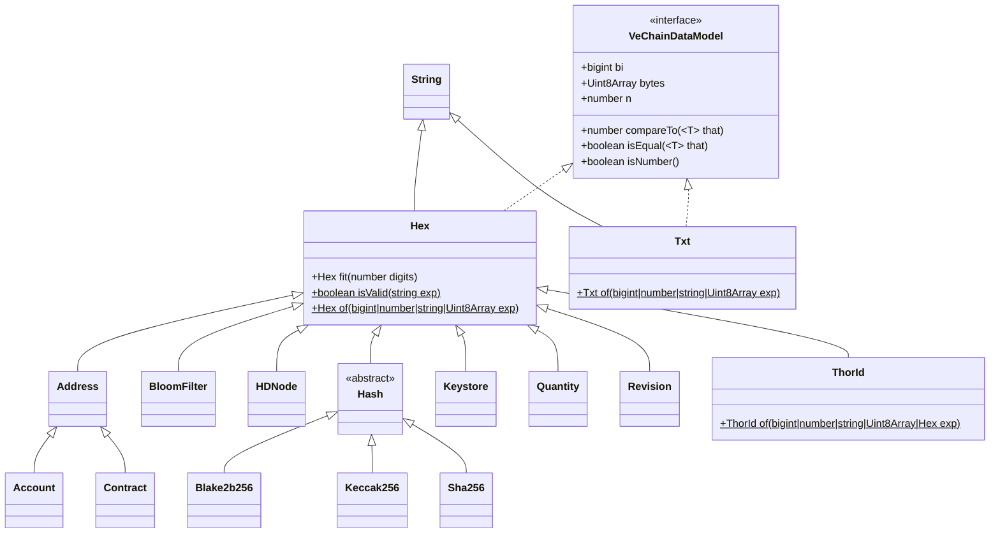

```mermaid
classDiagram
    class Account
    class Address
    class Blake2b256
    class BloomFilter
    class Contract
    class HDNode
    class Hash {
        <<abstract>>
    }
    class Hex {
        +Hex fit(number digits)
        +boolean isValid(string exp)$
        +Hex of(bigint|number|string|Uint8Array exp)$
    }
    class Keccak256 
    class Keystore
    class Quantity
    class Revision
    class Sha256
    class String
    class ThorId {
        +ThorId of(bigint|number|string|Uint8Array|Hex exp)$
    }
    class Txt {
        +Txt of(bigint|number|string|Uint8Array exp)$
    }
    class String
    class VeChainDataModel{
        <<interface>>
      +bigint bi
      +Uint8Array bytes
      +number n
      +number compareTo(~T~ that)
      +boolean isEqual(~T~ that)
      +boolean isNumber()
    }
    Address <|-- Account
    Address <|-- Contract
    Hash <|-- Blake2b256
    Hash <|-- Keccak256
    Hash <|-- Sha256
    Hex <|-- Address
    Hex <|-- BloomFilter
    Hex <|-- HDNode
    Hex <|-- Hash
    Hex <|-- Keystore
    Hex <|-- Quantity
    Hex <|-- Revision
    Hex <|-- ThorId
    String <|-- Hex
    String <|-- Txt
    VeChainDataModel <|.. Hex
    VeChainDataModel <|.. Txt
```
