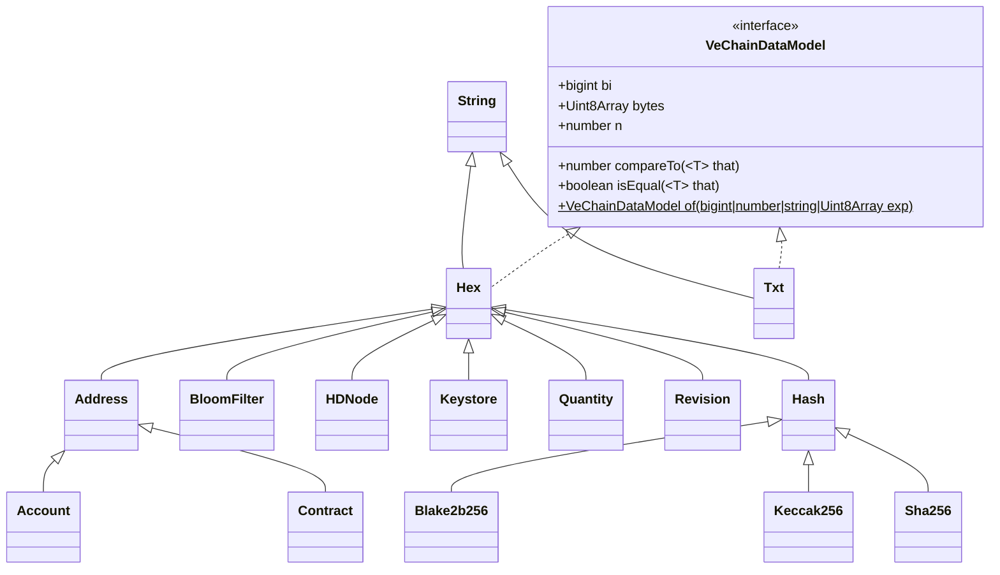

```mermaid
classDiagram
    class Account
    class Address
    class Blake2b256
    class BloomFilter
    class Contract
    class HDNode
    class Hex
    class Keccak256 
    class Keystore
    class Quantity
    class Revision
    class Sha256
    class String
    class Txt
    class String
    class VeChainDataModel{
        <<interface>>
      +bigint bi
      +Uint8Array bytes
      +number n
      +number compareTo(~T~ that)
      +boolean isEqual(~T~ that)
      +VeChainDataModel of(bigint|number|string|Uint8Array exp)$
    }
    Address <|-- Account
    Address <|-- Contract
    Hash <|-- Blake2b256
    Hash <|-- Keccak256
    Hash <|-- Sha256
    Hex <|-- Address
    Hex <|-- BloomFilter
    Hex <|-- HDNode
    Hex <|-- Hash
    Hex <|-- Keystore
    Hex <|-- Quantity
    Hex <|-- Revision
    String <|-- Hex
    String <|-- Txt
    VeChainDataModel <|.. Hex
    VeChainDataModel <|.. Txt
```
