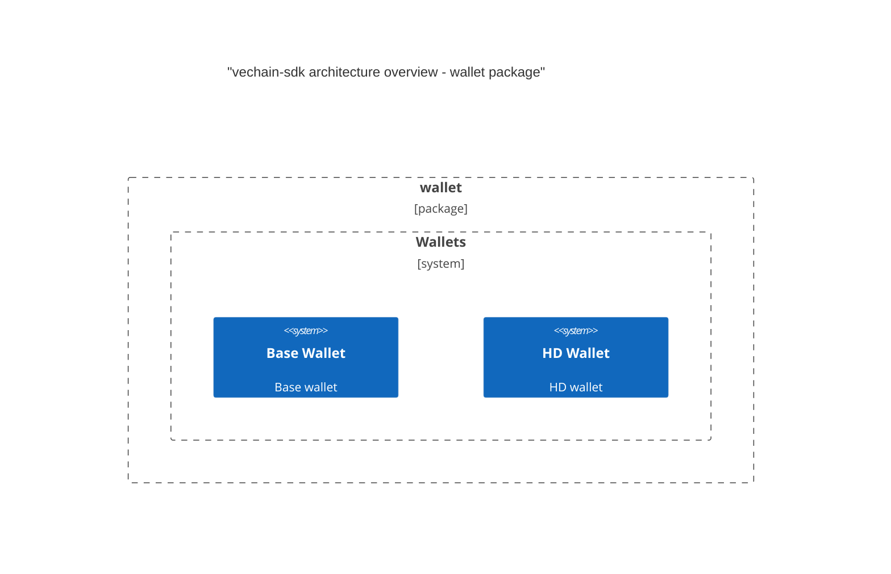

# Wallet Package C4 Architecture diagram
Main diagram for the wallet package.
It represents the architecture of the wallet package with its most important components.

```mermaid
C4Context
    title "vechain-sdk architecture overview - wallet package"

    Boundary(b0, "wallet", "package") {
        Boundary(b1, "Wallets") {
            System(base-wallet, "Base Wallet", "Base wallet")
            System(hd-wallet, "HD Wallet", "HD wallet")
        }
    }
```