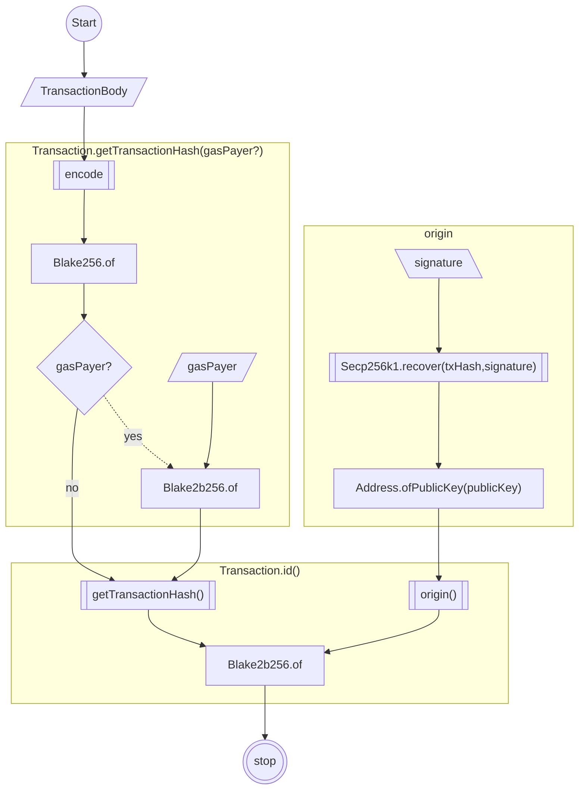

```mermaid
flowchart TD
    start((Start))
    stop(((stop)))
    body[/TransactionBody/]
    subgraph origin
        origin_signature[\signature\]
        origin_recover[["Secp256k1.recover(txHash,signature)"]]
        origin_address["Address.ofPublicKey(publicKey)"]
        origin_signature --> origin_recover
        origin_recover --> origin_address
        
    end
    subgraph txHash["Transaction.getTransactionHash(gasPayer?)"]
        txHash_encodeHash[Blake256.of]
        txHash_encodePayer[Blake2b256.of]
        txHash_encode[[encode]]
        txHash_payer?{gasPayer?}
        txHash_payer[/gasPayer/]
        txHash_encode --> txHash_encodeHash
        txHash_encodeHash --> txHash_payer?
        txHash_payer? -. yes .-> txHash_encodePayer
        txHash_payer --> txHash_encodePayer
    end
    subgraph tx_id["Transaction.id()"]
        id_hash[Blake2b256.of]
        id_origin[["origin()"]]
        id_txHash[["getTransactionHash()"]]
        id_origin --> id_hash
        id_txHash --> id_hash
    end
    start --> body
    body --> txHash_encode
    txHash_encodePayer --> id_txHash
    txHash_payer? -- no --> id_txHash
    id_hash --> stop
    origin_address --> id_origin
```
