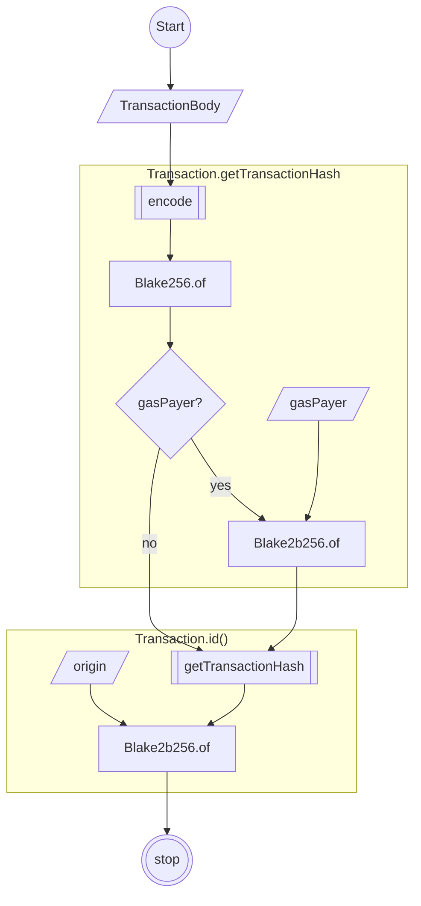

```mermaid
flowchart TD
    start((Start))
    stop(((stop)))
    body[/TransactionBody/]
    subgraph txHash["Transaction.getTransactionHash"]
        txHash_encodeHash[Blake256.of]
        txHash_encodePayer[Blake2b256.of]
        txHash_encode[[encode]]
        txHash_payer?{gasPayer?}
        txHash_payer[/gasPayer/]
        txHash_encode --> txHash_encodeHash
        txHash_encodeHash --> txHash_payer?
        txHash_payer? -- yes --> txHash_encodePayer
        txHash_payer --> txHash_encodePayer
    end
    subgraph id["Transaction.id()"]
        id_hash[Blake2b256.of]
        id_origin[/origin/]
        id_txHash[[getTransactionHash]]
        id_origin --> id_hash
        id_txHash --> id_hash
    end
    start --> body
    body --> txHash_encode
    txHash_encodePayer --> id_txHash
    txHash_payer? -- no --> id_txHash
    id_hash --> stop
```
