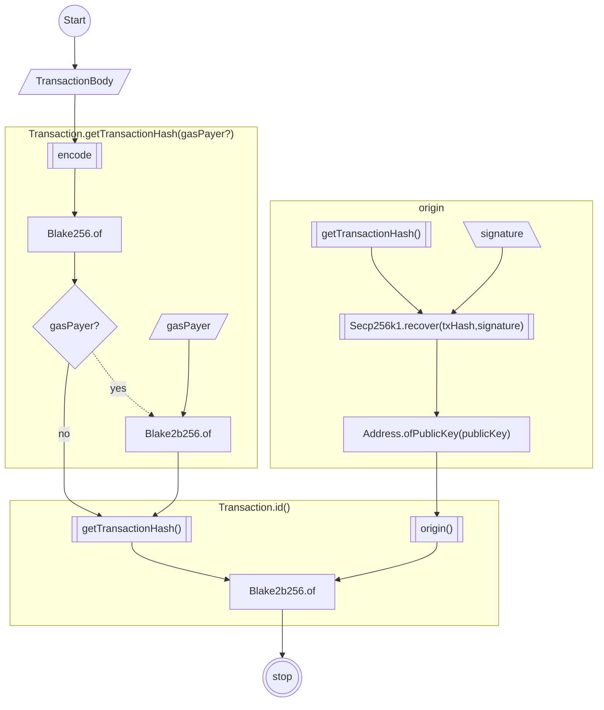

# Transaction IDs May Collide

The class [`Transaction`](../../../../../packages/core/src/transaction/Transaction.ts)
provides the computed property `Transaction.id()` to compute the transaction's identifier
as (l.242)

```typescript
public get id(): Blake2b256 {
    if (this.isSigned) {
        return Blake2b256.of(
            nc_utils.concatBytes(
                this.getTransactionHash().bytes,
                this.origin.bytes
            )
        );
    }
    throw new UnavailableTransactionField(
        'Transaction.id()',
        'not signed transaction: id unavailable',
        {fieldName: 'id'}
    );
}
```

The following flowchart shows the inputs, methods and properties involved.



## Not Delegated Transaction ID

NCC claims

_1. ... The transaction signature is not incorporated into the hash computation; only the transaction hash as well as
the
originator’s address are taken into account._ (p.12)

but we observe **the origin's address is derived by the origin's signature because the computed property**
`Transaction.origin` (l.304).

```typescript
public get origin(): Address
{
    if (this.signature !== undefined) {
        return Address.ofPublicKey(
            // Get the origin public key.
            Secp256k1.recover(
                this.getTransactionHash().bytes,
                // Get the (r, s) of ECDSA digital signature without gas payer params.
                this.signature.slice(0, Secp256k1.SIGNATURE_LENGTH)
            )
        );
    }
    throw new UnavailableTransactionField(
        'Transaction.origin()',
        'not signed transaction, no origin',
        {fieldName: 'origin'}
    );
}
```

NCC clams

_ ... if a transaction was signed by a signer multiple times (or in case of different
transactions with colliding getTransactionHash()), the resulting signed transactions would
have the same ID._ (p.13)

We observe if the transaction is signed multiple times, it results the same id if the
`TransactionBody` object is equal and the origin's signature is the same. 

### Question - ask NCC

Since the origin's address is a function of the origin's signature, **what is the difference
between to compute BLAKE2B256**

* **from the transaction hash and the origin's signature**, and
* **from the transaction hash and the origin's address derived from its signature?**

---

## Delegated Transaction ID

NCC claims

_2. In the case of delegated transactions, the function above also fails to take the gas
payer’s (aka delegator’s) signature and address into account._ (p.13)

We observe the claim is true: in the `Transaction.id` computed property at l.246

```typescript
this.getTransactionHash().bytes
```

does not pass the `gasPayer` as argument, hence NCC is right to claim

_... if a given to-be-delegated transaction were
signed by multiple different gas payers, the resulting IDs would all be equal (and would also
be equal to the ID of a non-delegated transaction)._ (p.13)

We observe the `reserved` flag in the `Transaction` body participates in the computed hash, hence
a delegated transaction should result in a different id then a not delegated transaction,
this is the only input in the BLAKE2B256 hash to differentiate the id transactions of the same
`TransactionBody` between the cases when the transaction is delegated and when is not. Since a transaction must
include the origin signature and if is delegated, must include the `reserved` property and a gas payer's signature,
we do not think there is a real useful case to forge the `reserved` field, nevertheless we think **

NCC recommends

_Consider modifying the id() function such that it includes the signer’s signature, and the
delegator’s (wrong name for the "gas payer") address and signature, if the transaction is delegated._ (p.13)

We think this should be done, but we must evaluate what is done in Thor as well and if the Thor ID algorithm must change
following the NCC recommendations.

NCC recommends

_... reflect on whether the id() function should product a different digest than the
getTransactionHash() of a delegated transaction._ (p.13)

**We think the id of delegated transaction should be different form its transaction's hash, we observe they are
different - matter of test - because the `Transaction.id` hashes the result of `Transaction.getTransactionHash` 
concatenated with the transaction;s origin address.**

---

### Question - ask the protocol team

**The `gasPayer` signature or its derived address is never considered in the computation of the transaction hash!**

* **What is the algorithm used in the protocol**?
  * **Is the same algorithm implemented the in e SDK?**
  * **The algorithm in the protocol does consider the `taxPayer` address and signature in the computation of the id?**

---

## ID Equality

We presume is correct to state equal
[`TransactionBody`](../../../../../packages/core/src/transaction/TransactionBody.d.ts)
instances signed by the same origin and gas payer should return the same id.
Since Thor rejects a transaction with a spent id, the above criteria should never be a problem;
Thor blockchain should never have two transaction with the same id, ids should be unique.
However, the `TransactionBody` class exposes the `nonce` property that is involved in the computation
of the transaction's hash.

### Question - ask the protocol team

The `Transaction.encode` method processes an object of the
[`TransactionBody`](../../../../../packages/core/src/transaction/TransactionBody.d.ts)
class, the class provides the `nonce` property 
The `nonce` property should be different for each transaction even if
the other properties of the transaction are equal, however no assumption are made about `nonce`.
* **Who sets the `nonce` property?**

---


