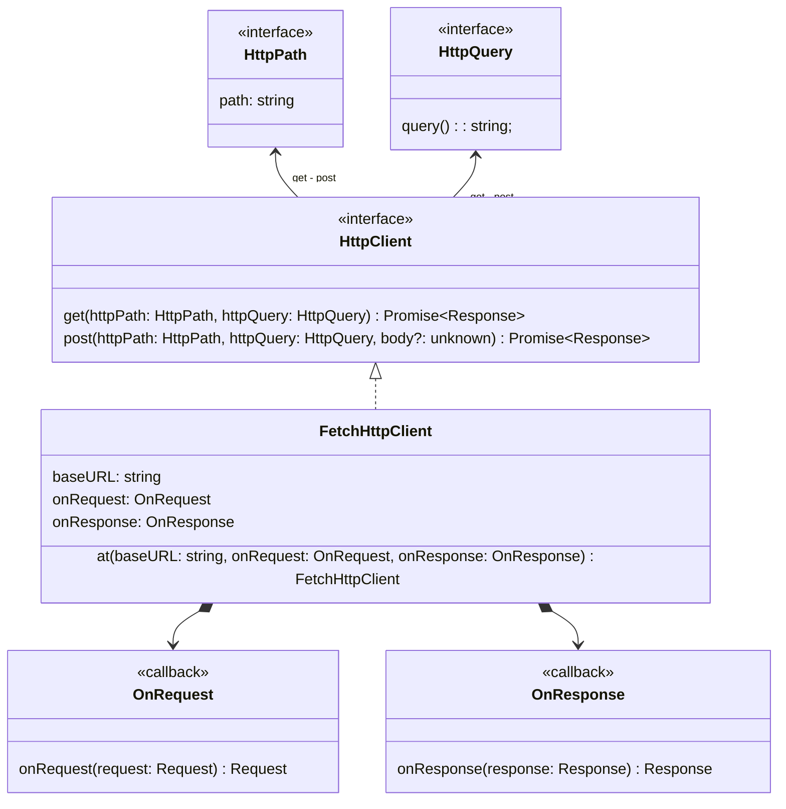

```mermaid
classDiagram
    class FetchHttpClient {
        baseURL: string
        onRequest: OnRequest
        onResponse: OnResponse
        at(baseURL: string, onRequest: OnRequest, onResponse: OnResponse) FetchHttpClient
    }
    class HttpClient {
        <<interface>>
        get(httpPath: HttpPath, httpQuery: HttpQuery) Promise~Response~
        post(httpPath: HttpPath, httpQuery: HttpQuery, body?: unknown) Promise~Response~
    }
    class HttpPath {
        <<interface>>
        path: string
    }
    class HttpQuery {
        <<interface>>
        query(): string;
    }
    class OnRequest {
        <<callback>>
        onRequest(request: Request) Request
    }
    class OnResponse{
        <<callback>>
        onResponse(response: Response) Response
    }
    FetchHttpClient *--> OnRequest
    FetchHttpClient *--> OnResponse
    HttpClient <|.. FetchHttpClient
    HttpPath <-- "get - post" HttpClient
    HttpQuery <-- "get - post" HttpClient
```
