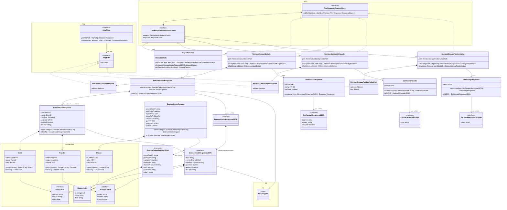

```mermaid
classDiagram
    namespace JS {
        class Array~Type~ {
            <<type>>
        }
    }
    namespace http {
        class HttpClient {
            <<interface>>
            get(httpPath: HttpPath) Promise~Response~
            post(httpPath: HttpPath, body?: unknown) Promise~Response~
        }
        class HttpPath {
            <<interface>>
            path: string
        }
    }
    namespace thor {
        class ThorRequest~RequestClass~ {
            <<interface>>
            askTo(httpClient: HttpClient Promise~ThorResponse~ResponseClass~~;
        }
        class ThorResponse~ResponseClass~ {
            <<interface>>
            request: ThorRequest~RequestClass~
            response: ResponseClass
        }
    }
    namespace transactions {
        class Clause {
            to: Address | null
            value: VET
            data: HexUInt
            constructor(json: ClauseJSON)
            toJSON() ClauseJSON
        }
        class ClauseJSON {
            to: string | null
            value: string
            data: string
        }
        class Event {
            address: Address
            topics: ThorId[]
            data: HexUInt
            constructor(json: EventJSON) Event
            toJSON() EventJSON
        }
        class EventJSON {
            <<interface>>
            address: string
            topics: string[]
            data: string
        }
        class Transfer {
            sender: Address
            recipient: Address
            amount: VET
            constructor(json: TransferJSON) Transfer
            toJSON() TransferJSON
        }
        class TransferJSON {
            <<interface>>
            sender: string
            recipient: string
            amount: string
        }
    }
    class ContractBytecode {
        code HexUInt
        constructor(json ContractBytecodeJSON) ContractBytecode
        toJSON() ContractBytecodeJSON
    }
    class ContractBytecodeJSON {
        <<interface>>
        code: string
    }
    class ExecuteCodesRequest {
        provedWork?: string
        gasPayer?: Address
        expiration?: UInt
        blockRef?: BlockRef
        clauses?: Clause[]
        gas?: VTHO
        gasPrice?: VTHO
        caller?: Address
        constructor(json: ExecuteCodesRequestJSON) ExecuteCodesRequest
        toJSON() ExecuteCodesRequestJSON
    }
    class ExecuteCodesRequestJSON {
        <<interface>>
        provedWork?: string
        gasPayer?: string
        expiration?: number
        blockRef?: string
        clauses?: ClauseJSON[]
        gas?: number
        gasPrice?: string
        caller?: string
    }
    class ExecuteCodeResponse {
        data: HexUInt
        events: Event[]
        transfers: Transfer[]
        gasUsed: VTHO
        reverted: boolean
        vmError: string
        constructor(json: ExecuteCodeResponseJSON)
        toJSON() ExecuteCodeResponseJSON
    }
    class ExecuteCodeResponseJSON {
        <<interface>>
        data: string
        events: EventJSON[]
        transfers: TransferJSON[]
        gasUsed: number
        reverted: boolean
        vmError: string
    }
    class ExecuteCodesResponse {
        constructor(json: ExecuteCodesResponseJSON) ExecuteCodesResponse
        toJSON() ExecuteCodesResponseJSON
    }
    class ExecuteCodesResponseJSON {
        <<interface>>
    }
    class GetAccountResponse {
        balance: VET
        energy: VTHO
        hasCode: boolean
        constructor(json: GetAccountResponseJSON) GetAccountResponse
    }
    class GetAccountResponseJSON {
        <<interface>>
        balance: string
        energy: string
        hasCode: boolean
    }
    class GetStorageResponse {
        value: ThorId
        constructor(json: GetStorageResponseJSON) GetStorageResponse
        toJSON() GetStorageResponseJSON
    }
    class GetStorageResponseJSON {
        <<interface>>
        value: string
    }
    class InspectClauses {
        PATH: HttpPath$
        askTo(httpClient: HttpClient) Promise~ThorResponse~ExecuteCodesResponse~~
        of(request: ExecuteCodesRequestJSON) InspectClauses$
        withRevision(revision: Revision) InspectClauses
    }
    class RetrieveAccountDetails {
        path: RetrieveAccountDetailsPath
        askTo(httpClient: HttpClient) Promise~ThorResponse~GetAccountResponse~~
        of(address: Address) RetrieveAccountDetails$
    }
    class RetrieveAccountDetailsPath {
        address: Address
    }
    class RetrieveContractBytecode {
        path: RetrieveContractBytecodePath
        askTo(httpClient: HttpClient) Promise~ThorResponse~ContractBytecode~~
        of(address: Address) RetrieveContractBytecode
    }
    class RetrieveContractBytecodePath {
        address: Address
    }
    class RetrieveStoragePositionValue {
        path: RetrieveStoragePositionValuePath
        askTo(httpClient: HttpClient) Promise~ThorResponse~GetStorageResponse~~
        of(address: Address, key: BlockId) RetrieveStoragePositionValue$
    }
    class RetrieveStoragePositionValuePath {
        address: Address
        key: BlockId
    }
    Clause --> "new - toJSON" ClauseJSON
    ContractBytecode --> "new - toJSON" ContractBytecodeJSON
    Event --> "new - toJSON" EventJSON
    ExecuteCodeResponse *--> Event
    ExecuteCodeResponse *--> Transfer
    ExecuteCodeResponse --> "new - toJSON" ExecuteCodeResponseJSON
    ExecuteCodeResponseJSON *--> EventJSON
    ExecuteCodeResponseJSON *--> TransferJSON
    ExecuteCodeResponseJSON --|> Array
    ExecuteCodesRequest *--> Clause
    ExecuteCodesRequest --> "new - toJSON" ExecuteCodesRequestJSON
    ExecuteCodesRequestJSON *--> ClauseJSON
    ExecuteCodesResponse *--> "ExecuteCodeResponseJSON[]" ExecuteCodeResponse
    ExecuteCodesResponse --> "new - toJSON" ExecuteCodesResponseJSON
    ExecuteCodesResponse --|> Array 
    ExecuteCodesResponseJSON *--> "ExecuteCodeResponseJSON[]" ExecuteCodeResponseJSON
    GetAccountResponse --> "new - toJSON" GetAccountResponseJSON
    GetStorageResponse --> "new - toJSON" GetStorageResponseJSON
    HttpClient --> "get - post" HttpPath
    HttpPath <|.. RetrieveAccountDetailsPath
    HttpPath <|.. RetrieveContractBytecodePath
    HttpPath <|.. RetrieveStoragePositionValuePath
    InspectClauses --> "askTo" ExecuteCodesResponse
    RetrieveAccountDetails *--> RetrieveAccountDetailsPath
    RetrieveAccountDetails --> "askTo" GetAccountResponse
    RetrieveContractBytecode *--> RetrieveContractBytecodePath
    RetrieveContractBytecode --> "askTo" ContractBytecode
    RetrieveStoragePositionValue *--> RetrieveStoragePositionValuePath
    RetrieveStoragePositionValue --> "askTo" GetStorageResponse
    ThorRequest <--* ThorResponse
    ThorRequest <|.. InspectClauses
    ThorRequest <|.. RetrieveAccountDetails
    ThorRequest <|.. RetrieveContractBytecode
    ThorRequest <|.. RetrieveStoragePositionValue
    ThorResponse <-- "askTo" InspectClauses
    ThorResponse <-- "askTo" RetrieveAccountDetails
    ThorResponse <-- "askTo" RetrieveContractBytecode
    ThorResponse <-- "askTo" RetrieveStoragePositionValue
    Transfer --> "new - toJSON" TransferJSON
```
