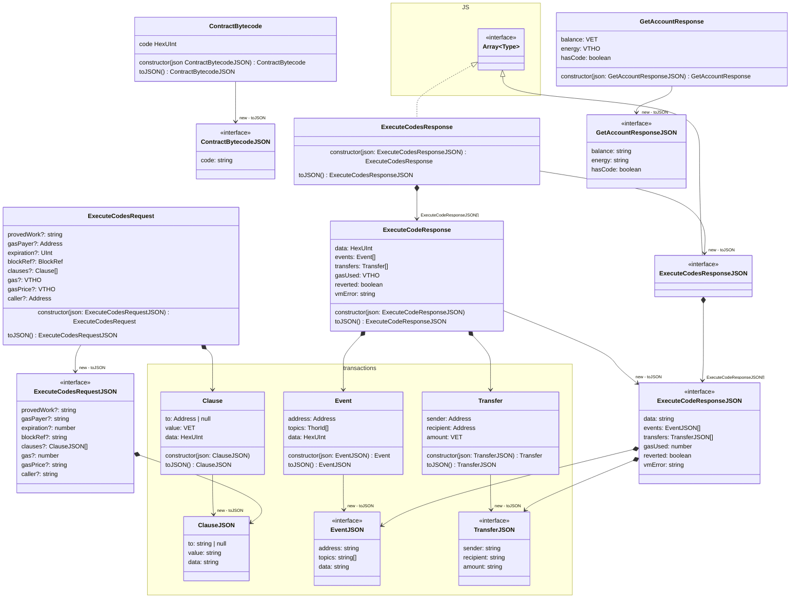

```mermaid
classDiagram
    namespace JS {
        class Array~Type~ {
            <<interface>>
        }
    }
    namespace transactions {
        class Clause {
            to: Address | null
            value: VET
            data: HexUInt
            constructor(json: ClauseJSON)
            toJSON() ClauseJSON
        }
        class ClauseJSON {
            to: string | null
            value: string
            data: string
        }
        class Event {
            address: Address
            topics: ThorId[]
            data: HexUInt
            constructor(json: EventJSON) Event
            toJSON() EventJSON
        }
        class EventJSON {
            <<interface>>
            address: string
            topics: string[]
            data: string
        }
        class Transfer {
            sender: Address
            recipient: Address
            amount: VET
            constructor(json: TransferJSON) Transfer
            toJSON() TransferJSON
        }
        class TransferJSON {
            <<interface>>
            sender: string
            recipient: string
            amount: string
        }
    }
    class ContractBytecode {
        code HexUInt
        constructor(json ContractBytecodeJSON) ContractBytecode
        toJSON() ContractBytecodeJSON
    }
    class ContractBytecodeJSON {
        <<interface>>
        code: string
    }
    class ExecuteCodesRequest {
        provedWork?: string
        gasPayer?: Address
        expiration?: UInt
        blockRef?: BlockRef
        clauses?: Clause[]
        gas?: VTHO
        gasPrice?: VTHO
        caller?: Address
        constructor(json: ExecuteCodesRequestJSON) ExecuteCodesRequest
        toJSON() ExecuteCodesRequestJSON
    }
    class ExecuteCodesRequestJSON {
        <<interface>>
        provedWork?: string
        gasPayer?: string
        expiration?: number
        blockRef?: string
        clauses?: ClauseJSON[]
        gas?: number
        gasPrice?: string
        caller?: string
    }
    class ExecuteCodeResponse {
        data: HexUInt
        events: Event[]
        transfers: Transfer[]
        gasUsed: VTHO
        reverted: boolean
        vmError: string
        constructor(json: ExecuteCodeResponseJSON)
        toJSON() ExecuteCodeResponseJSON
    }
    class ExecuteCodeResponseJSON {
        <<interface>>
        data: string
        events: EventJSON[]
        transfers: TransferJSON[]
        gasUsed: number
        reverted: boolean
        vmError: string
    }
    class ExecuteCodesResponse {
        constructor(json: ExecuteCodesResponseJSON) ExecuteCodesResponse
        toJSON() ExecuteCodesResponseJSON
    }
    class ExecuteCodesResponseJSON {
        <<interface>>
    }
    class GetAccountResponse {
        balance: VET
        energy: VTHO
        hasCode: boolean
        constructor(json: GetAccountResponseJSON) GetAccountResponse
    }
    class GetAccountResponseJSON {
        <<interface>>
        balance: string
        energy: string
        hasCode: boolean
    }
    Array <|.. ExecuteCodesResponse
    Array <|-- ExecuteCodesResponseJSON
    Clause --> "new - toJSON" ClauseJSON
    ContractBytecode --> "new - toJSON" ContractBytecodeJSON
    Event --> "new - toJSON" EventJSON
    ExecuteCodesRequest --> "new - toJSON" ExecuteCodesRequestJSON
    ExecuteCodeResponse --> "new - toJSON" ExecuteCodeResponseJSON
    ExecuteCodesResponse --> "new - toJSON" ExecuteCodesResponseJSON
    GetAccountResponse --> "new - toJSON" GetAccountResponseJSON
    Transfer --> "new - toJSON" TransferJSON
    ExecuteCodesRequest *--> Clause
    ExecuteCodesRequestJSON *--> ClauseJSON
    ExecuteCodeResponse *--> Event
    ExecuteCodeResponse *--> Transfer
    ExecuteCodeResponseJSON *--> EventJSON
    ExecuteCodeResponseJSON *--> TransferJSON
    ExecuteCodesResponse *--> "ExecuteCodeResponseJSON[]" ExecuteCodeResponse
    ExecuteCodesResponseJSON *--> "ExecuteCodeResponseJSON[]" ExecuteCodeResponseJSON
```
