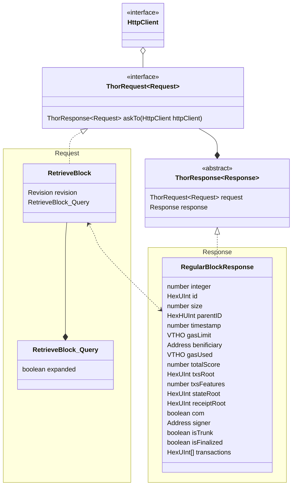

```mermaid
classDiagram
    class HttpClient {
        <<interface>>
    }
    class ThorRequest~Request~ {
        <<interface>>
        ThorResponse~Request~ askTo(HttpClient httpClient)
    }
    class ThorResponse~Response~ {
        <<abstract>>
        ThorRequest~Request~ request
        Response response
    }
    namespace Request {
        class RetrieveBlock {
            Revision revision
            RetrieveBlock_Query
        }
        class RetrieveBlock_Query {
            boolean expanded
        }
    }
    namespace Response {
        class RegularBlockResponse {
            number integer
            HexUInt id
            number size
            HexHUInt parentID
            number timestamp
            VTHO gasLimit
            Address benificiary
            VTHO gasUsed
            number totalScore
            HexUInt txsRoot
            number txsFeatures
            HexUInt stateRoot
            HexUInt receiptRoot
            boolean com
            Address signer
            boolean isTrunk
            boolean isFinalized
            HexUInt[] transactions
        }
    }
    
    HttpClient o-- ThorRequest
    ThorRequest <|.. RetrieveBlock
    ThorResponse <|.. RegularBlockResponse
    
    ThorRequest --* ThorResponse
    
    RetrieveBlock --* RetrieveBlock_Query
    
    RetrieveBlock <..> RegularBlockResponse
```
