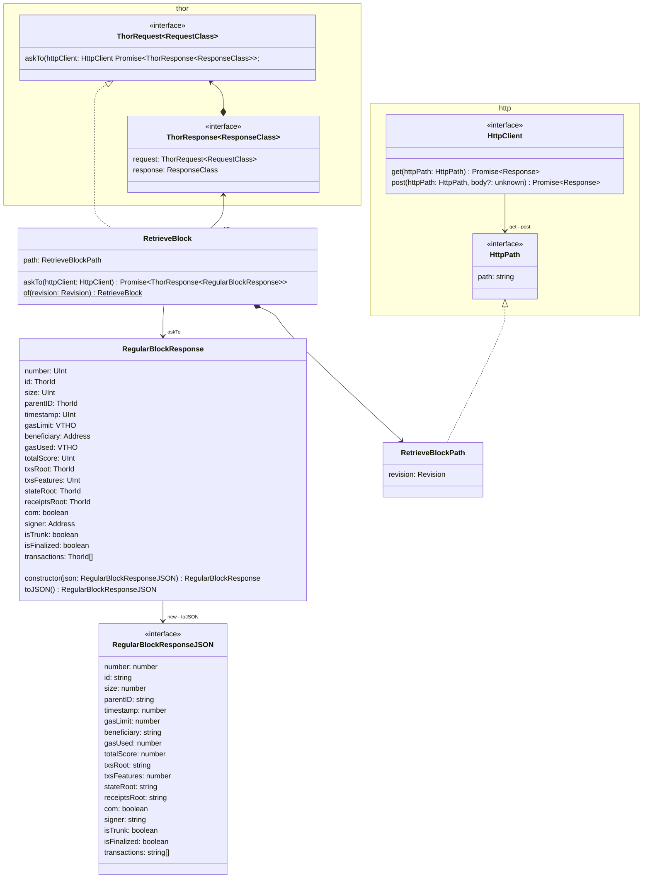

```mermaid
classDiagram
    namespace http {
        class HttpClient {
            <<interface>>
            get(httpPath: HttpPath) Promise~Response~
            post(httpPath: HttpPath, body?: unknown) Promise~Response~
        }
        class HttpPath {
            <<interface>>
            path: string
        }
    }
    namespace thor {
        class ThorRequest~RequestClass~ {
            <<interface>>
            askTo(httpClient: HttpClient Promise~ThorResponse~ResponseClass~~;
        }
        class ThorResponse~ResponseClass~ {
            <<interface>>
            request: ThorRequest~RequestClass~
            response: ResponseClass
        }
    }
    class RegularBlockResponse {
        number: UInt
        id: ThorId
        size: UInt
        parentID: ThorId
        timestamp: UInt
        gasLimit: VTHO
        beneficiary: Address
        gasUsed: VTHO
        totalScore: UInt
        txsRoot: ThorId
        txsFeatures: UInt
        stateRoot: ThorId
        receiptsRoot: ThorId
        com: boolean
        signer: Address
        isTrunk: boolean
        isFinalized: boolean
        transactions: ThorId[]
        constructor(json: RegularBlockResponseJSON) RegularBlockResponse
        toJSON() RegularBlockResponseJSON
    }
    class RegularBlockResponseJSON {
        <<interface>>
        number: number
        id: string
        size: number
        parentID: string
        timestamp: number
        gasLimit: number
        beneficiary: string
        gasUsed: number
        totalScore: number
        txsRoot: string
        txsFeatures: number
        stateRoot: string
        receiptsRoot: string
        com: boolean
        signer: string
        isTrunk: boolean
        isFinalized: boolean
        transactions: string[]
    }
    class RetrieveBlock {
        path: RetrieveBlockPath
        askTo(httpClient: HttpClient) Promise~ThorResponse~RegularBlockResponse~~
        of(revision: Revision) RetrieveBlock$
    }
    class RetrieveBlockPath {
        revision: Revision
    }
    ThorResponse <-- "askTo" RetrieveBlock
    ThorRequest <|.. RetrieveBlock
    ThorRequest <--* ThorResponse
    HttpPath <|.. RetrieveBlockPath
    RetrieveBlock --> "askTo" RegularBlockResponse
    RetrieveBlock *--> RetrieveBlockPath
    RegularBlockResponse --> "new - toJSON" RegularBlockResponseJSON
    HttpClient --> "get - post" HttpPath
```
