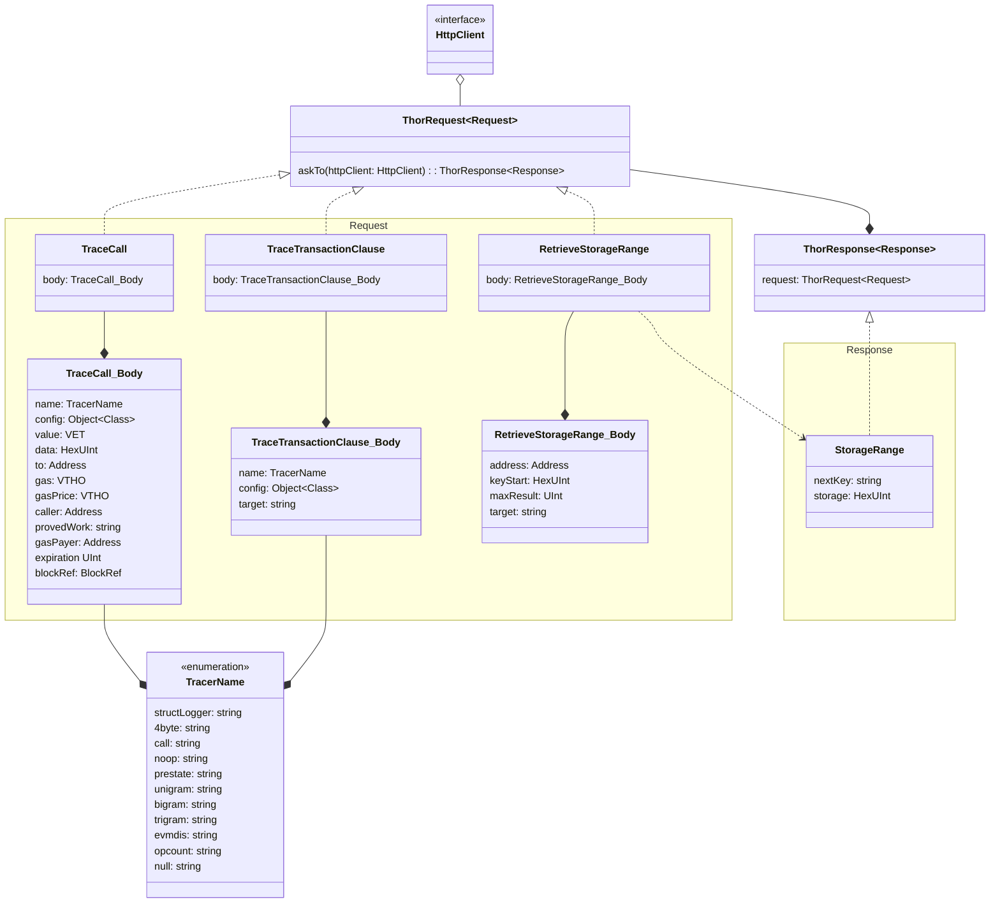

```mermaid
classDiagram
    class HttpClient {
        <<interface>>
    }
    class ThorRequest~Request~ {
        askTo(httpClient: HttpClient): ThorResponse~Response~
    }
    class ThorResponse~Response~ {
        request: ThorRequest~Request~
    }
    namespace Request {
        class TraceTransactionClause {
            body: TraceTransactionClause_Body
        }
        class TraceTransactionClause_Body {
            name: TracerName
            config: Object~Class~
            target: string
        }
        class TraceCall {
            body: TraceCall_Body
        }
        class TraceCall_Body {
            name: TracerName
            config: Object~Class~
            value: VET
            data: HexUInt
            to: Address
            gas: VTHO
            gasPrice: VTHO
            caller: Address
            provedWork: string
            gasPayer: Address
            expiration UInt
            blockRef: BlockRef
        }
        class RetrieveStorageRange {
            body: RetrieveStorageRange_Body
        }
        class RetrieveStorageRange_Body {
            address: Address
            keyStart: HexUInt
            maxResult: UInt
            target: string
        }
    }
    namespace Response {
        class StorageRange {
            nextKey: string
            storage: HexUInt
        }
    }
    class TracerName {
        <<enumeration>>
        structLogger: string
        4byte: string
        call: string
        noop: string
        prestate: string
        unigram: string
        bigram: string
        trigram: string
        evmdis: string
        opcount: string
        null: string
    }
    HttpClient o-- ThorRequest
    ThorRequest <|.. RetrieveStorageRange
    ThorRequest <|.. TraceCall
    ThorRequest <|.. TraceTransactionClause
    ThorResponse <|.. StorageRange
    RetrieveStorageRange --* RetrieveStorageRange_Body
    ThorRequest --* ThorResponse
    TraceCall --* TraceCall_Body
    TraceCall_Body --* TracerName
    TraceTransactionClause --* TraceTransactionClause_Body
    TraceTransactionClause_Body --* TracerName
    RetrieveStorageRange ..> StorageRange
```
