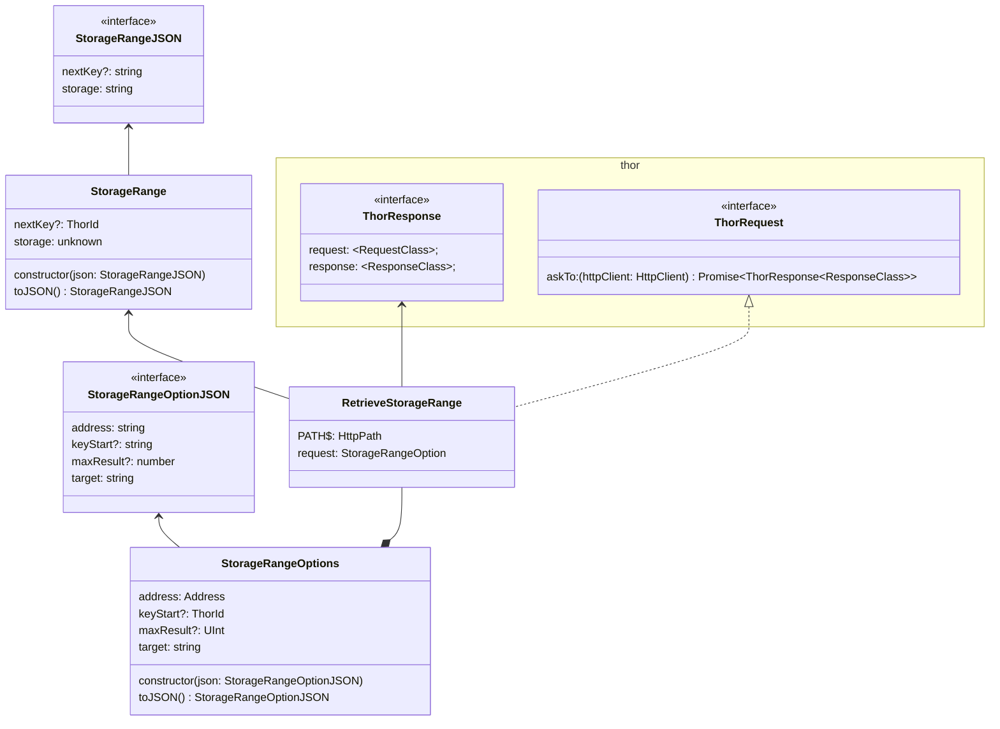

```mermaid
classDiagram
    class RetrieveStorageRange {
        PATH$: HttpPath
        request: StorageRangeOption
    }
    class StorageRange {
        nextKey?: ThorId
        storage: unknown
        constructor(json: StorageRangeJSON)
        toJSON() StorageRangeJSON
    }
    class StorageRangeJSON {
        <<interface>>
        nextKey?: string
        storage: string
    }
    class StorageRangeOptions {
        address: Address
        keyStart?: ThorId
        maxResult?: UInt
        target: string
        constructor(json: StorageRangeOptionJSON)
        toJSON() StorageRangeOptionJSON
    }
    class StorageRangeOptionJSON {
        <<interface>>
        address: string
        keyStart?: string
        maxResult?: number
        target: string
    }
    namespace thor {
        class ThorRequest {
            <<interface>>
            askTo: (httpClient: HttpClient) Promise~ThorResponse~ResponseClass~~
        }
        class ThorResponse {
            <<interface>>
            request: ~RequestClass~;
            response: ~ResponseClass~;
        }
    }
    StorageRange <-- RetrieveStorageRange
    StorageRangeJSON <-- StorageRange
    StorageRangeOptionJSON <-- StorageRangeOptions
    ThorResponse <-- RetrieveStorageRange
    ThorRequest <|.. RetrieveStorageRange
    RetrieveStorageRange --* StorageRangeOptions
```
