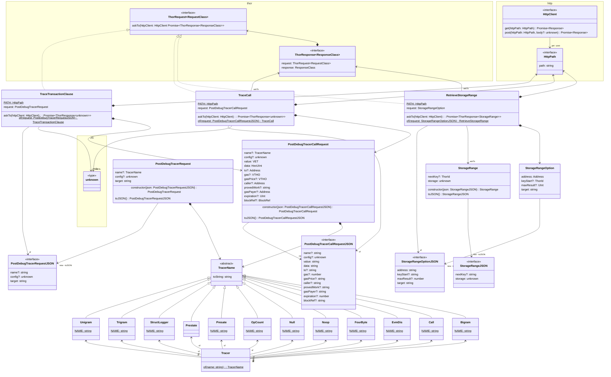

```mermaid
classDiagram
    namespace JS {
        class unknown {
            <<type>>
        }
    }
    namespace http {
        class HttpClient {
            <<interface>>
            get(httpPath: HttpPath) Promise~Response~
            post(httpPath: HttpPath, body?: unknown) Promise~Response~
        }
        class HttpPath {
            <<interface>>
            path: string
        }
    }
    namespace thor {
        class ThorRequest~RequestClass~ {
            <<interface>>
            askTo(httpClient: HttpClient Promise~ThorResponse~ResponseClass~~
        }
        class ThorResponse~ResponseClass~ {
            <<interface>>
            request: ThorRequest~RequestClass~
            response: ResponseClass
        }
    }
    class Bigram {
        NAME: string$
    }
    class Call {
        NAME: string$
    }
    class EvmDis {
        NAME: string$
    }
    class FourByte {
        NAME: string$
    }
    class Noop {
        NAME: string$
    }
    class Null {
        NAME: string$
    }
    class OpCount {
        NAME: string$
    }
    class PostDebugTracerCallRequest {
        name?: TracerName
        config?: unknown
        value: VET
        data: HexUInt
        to?: Address
        gas?: VTHO
        gasPrice?: VTHO
        caller?: Address
        provedWork?: string
        gasPayer?: Address
        expiration?: UInt
        blockRef?: BlockRef
        constructor(json: PostDebugTracerCallRequestJSON) PostDebugTracerCallRequest
        toJSON() PostDebugTracerCallRequestJSON
    }
    class PostDebugTracerCallRequestJSON {
        <<interface>>
        name?: string
        config?: unknown
        value: string
        data: string
        to?: string
        gas?: number
        gasPrice?: string
        caller?: string
        provedWork?: string
        gasPayer?: string
        expiration?: number
        blockRef?: string
    }
    class PostDebugTracerRequest {
        name?: TracerName
        config?: unknown
        target: string
        constructor(json: PostDebugTracerRequestJSON) PostDebugTracerRequest
        toJSON() PostDebugTracerRequestJSON
    }
    class PostDebugTracerRequestJSON {
        <<interface>>
        name?: string
        config?: unknown
        target: string
    }
    class Presate {
        NAME: string$
    }
    class RetrieveStorageRange {
        PATH: HttpPath$
        request: StorageRangeOption
        askTo(httpClient: HttpClient): Promise~ThorResponse~StorageRange~~
        of(request: StorageRangeOptionJSON) RetrieveStorageRange$
    }
    class StorageRange {
        nextKey?: ThorId
        storage: unknown
        constructor(json: StorageRangeJSON) StorageRange
        toJSON() StorageRangeJSON
    }
    class StorageRangeJSON {
        <<interface>>
        nextKey?: string
        storage: unknown
    }
    class StorageRangeOption {
        address: Address
        keyStart?: ThorId
        maxResult?: UInt
        target: string
    }
    class StorageRangeOptionJSON {
        <<interface>>
        address: string
        keyStart?: string
        maxResult?: number
        target: string
    }
    class StructLogger {
        NAME: string$
    }
    class TraceCall {
        PATH: HttpPath$
        request: PostDebugTracerCallRequest
        askTo(httpClient: HttpClient): Promise~ThorResponse~unknown~~
        of(request: PostDebugTracerCallRequestJSON) TraceCall$
    }
    class Tracer {
        of(name: string): TracerName$
    }
    class TracerName {
        <<abstract>>
        toString: string
    }
    class TraceTransactionClause {
        PATH: HttpPath$
        request: PostDebugTracerRequest
        askTo(httpClient: HttpClient): Promise~ThorResponse~unknown~~
        of(request: PostDebugTracerRequestJSON) TraceTransactionClause$
    }
    class Trigram {
        NAME: string$
    }
    class Unigram {
        NAME: string$
    }
    Bigram <-- "of" Tracer
    Call <-- "of" Tracer
    EvmDis <-- "of" Tracer
    FourByte <-- "of" Tracer
    HttpClient --> "get - post" HttpPath
    HttpPath <--* RetrieveStorageRange
    HttpPath <--* TraceCall
    HttpPath <--* TraceTransactionClause
    Noop <-- "of" Tracer
    Null <-- "of" Tracer
    OpCount <-- "of" Tracer
    PostDebugTracerCallRequest *--> TracerName
    PostDebugTracerCallRequest --> "new - toJSON" PostDebugTracerCallRequestJSON
    PostDebugTracerRequest *--> TracerName
    PostDebugTracerRequest --> "new - toJSON" PostDebugTracerRequestJSON
    Presate <-- "of" Tracer
    Prestate <-- "of" Tracer
    RetrieveStorageRange *--> StorageRangeOption
    RetrieveStorageRange --> "askTo" StorageRange
    RetrieveStorageRange --> "of" StorageRangeOptionJSON
    StorageRange --> "new - toJSON" StorageRangeJSON
    StorageRangeOption --> "new - toJSON" StorageRangeOptionJSON
    StructLogger <-- "of" Tracer
    ThorRequest <--* ThorResponse
    ThorRequest <|.. RetrieveStorageRange
    ThorRequest <|.. TraceCall
    ThorRequest <|.. TraceTransactionClause
    ThorResponse <-- "askTo" RetrieveStorageRange
    ThorResponse <-- "askTo" TraceCall
    TraceCall *--> PostDebugTracerCallRequest
    TraceCall --> "askTo" unknown
    TraceCall --> "of" PostDebugTracerCallRequestJSON
    TraceTransactionClause *--> PostDebugTracerCallRequest
    TraceTransactionClause --> "askTo" unknown
    TraceTransactionClause --> "of" PostDebugTracerRequestJSON
    TracerName <|-- Bigram
    TracerName <|-- Call
    TracerName <|-- EvmDis
    TracerName <|-- FourByte
    TracerName <|-- Noop
    TracerName <|-- Null
    TracerName <|-- OpCount
    TracerName <|-- Presate
    TracerName <|-- Prestate
    TracerName <|-- StructLogger
    TracerName <|-- Trigram
    TracerName <|-- Unigram
    Trigram <-- "of" Tracer
    Unigram <-- "of" Tracer
```
