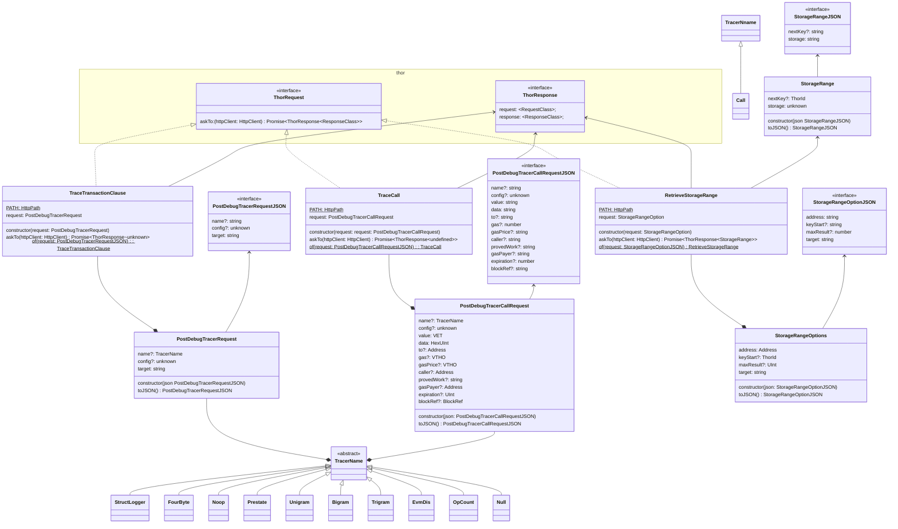

```mermaid
classDiagram
    class PostDebugTracerCallRequest {
        name?: TracerName
        config?: unknown
        value: VET
        data: HexUInt
        to?: Address
        gas?: VTHO
        gasPrice?: VTHO
        caller?: Address
        provedWork?: string
        gasPayer?: Address
        expiration?: UInt
        blockRef?: BlockRef
        constructor(json: PostDebugTracerCallRequestJSON)
        toJSON() PostDebugTracerCallRequestJSON
    }
    class PostDebugTracerCallRequestJSON {
        <<interface>>
        name?: string
        config?: unknown
        value: string
        data: string
        to?: string
        gas?: number
        gasPrice?: string
        caller?: string
        provedWork?: string
        gasPayer?: string
        expiration?: number
        blockRef?: string
    }
    class PostDebugTracerRequest {
        name?: TracerName
        config?: unknown
        target: string
        constructor(json PostDebugTracerRequestJSON)
        toJSON() PostDebugTracerRequestJSON
    }
    class PostDebugTracerRequestJSON {
        <<interface>>
        name?: string
        config?: unknown
        target: string
    }
    class RetrieveStorageRange {
        PATH: HttpPath$
        request: StorageRangeOption
        constructor(request: StorageRangeOption)
        askTo(httpClient: HttpClient) Promise~ThorResponse~StorageRange~~
        of(request: StorageRangeOptionJSON) RetrieveStorageRange$
    }
    class StorageRange {
        nextKey?: ThorId
        storage: unknown
        constructor(json StorageRangeJSON)
        toJSON() StorageRangeJSON
       }
    class StorageRangeJSON {
        <<interface>>
        nextKey?: string
        storage: string
    }
    class StorageRangeOptions {
        address: Address
        keyStart?: ThorId
        maxResult?: UInt
        target: string
        constructor(json: StorageRangeOptionJSON)
        toJSON() StorageRangeOptionJSON
    }
    class StorageRangeOptionJSON {
        <<interface>>
        address: string
        keyStart?: string
        maxResult?: number
        target: string
    }
    class TraceCall {
        PATH: HttpPath$
        request: PostDebugTracerCallRequest
        constructor(request: request: PostDebugTracerCallRequest)
        askTo(httpClient: HttpClient) Promise~ThorResponse~undefined~~
        of(request: PostDebugTracerCallRequestJSON): TraceCall$
    }
    class TraceTransactionClause {
        PATH: HttpPath$
        request: PostDebugTracerRequest
        constructor(request: PostDebugTracerRequest)
        askTo(httpClient: HttpClient) Promise~ThorResponse~unknown~
        of(request: PostDebugTracerRequestJSON): TraceTransactionClause$
    }
    class TracerName {
        <<abstract>>
    }
    namespace thor {
        class ThorRequest {
            <<interface>>
            askTo: (httpClient: HttpClient) Promise~ThorResponse~ResponseClass~~
        }
        class ThorResponse {
            <<interface>>
            request: ~RequestClass~;
            response: ~ResponseClass~;
        }
    }
    PostDebugTracerCallRequestJSON <-- PostDebugTracerCallRequest
    PostDebugTracerRequestJSON <-- PostDebugTracerRequest
    StorageRange <-- RetrieveStorageRange
    StorageRangeJSON <-- StorageRange
    StorageRangeOptionJSON <-- StorageRangeOptions
    ThorResponse <-- RetrieveStorageRange
    ThorResponse <-- TraceCall
    ThorResponse <-- TraceTransactionClause
    ThorRequest <|.. RetrieveStorageRange
    ThorRequest <|.. TraceCall
    ThorRequest <|.. TraceTransactionClause
    TracerName <|-- StructLogger
    TracerName <|-- FourByte
    TracerNname <|-- Call
    TracerName <|-- Noop
    TracerName <|-- Prestate
    TracerName <|-- Unigram
    TracerName <|-- Bigram
    TracerName <|-- Trigram
    TracerName <|-- EvmDis
    TracerName <|-- OpCount
    TracerName <|-- Null
    RetrieveStorageRange --* StorageRangeOptions
    PostDebugTracerCallRequest --* TracerName
    PostDebugTracerRequest --* TracerName
    TraceCall --* PostDebugTracerCallRequest
    TraceTransactionClause --* PostDebugTracerRequest
```
