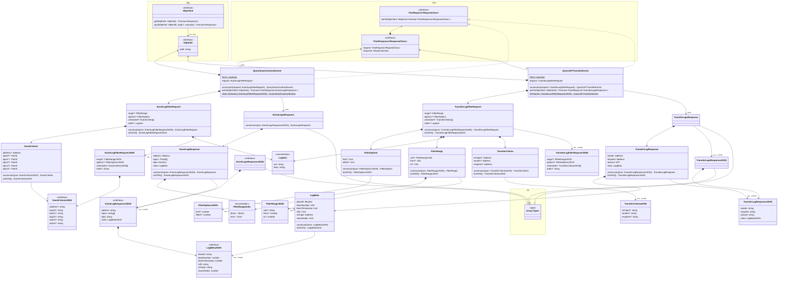

```mermaid
classDiagram
    namespace JS {
        class Array~Type~ {
            <<type>>
        }
    }
    namespace http {
        class HttpClient {
            <<interface>>
            get(httpPath: HttpPath) Promise~Response~
            post(httpPath: HttpPath, body?: unknown) Promise~Response~
        }
        class HttpPath {
            <<interface>>
            path: string
        }
    }
    namespace thor {
        class ThorRequest~RequestClass~ {
            <<interface>>
            askTo(httpClient: HttpClient Promise~ThorResponse~ResponseClass~~
        }
        class ThorResponse~ResponseClass~ {
            <<interface>>
            request: ThorRequest~RequestClass~
            response: ResponseClass
        }
    }
    class EventCriteria {
        address?: Address
        topic0?: ThorId
        topic1?: ThorId
        topic2?: ThorId
        topic3?: ThorId
        topic4?: ThorId
        constructor(json: EventCriteriaJSON) EventCriteria
        toJSON() EventCriteriaJSON
    }
    class EventCriteriaJSON {
        <<interface>>
        address?: string
        topic0?: string
        topic1?: string
        topic2?: string
        topic3?: string
        topic4?: string
    }
    class EventLogFilterRequest {
        range?: FilterRange
        options?: FilterOptions
        criteriaSet?: EventCriteria[]
        order?: LogSort
        constructor(json: EventLogFilterRequestJSON) EventLogFilterRequest
        toJSON() EventLogFilterRequestJSON
    }
    class EventLogFilterRequestJSON {
        range?: FilterRangeJSON
        options?: FilterOptionsJSON
        criteriaSet?: EventCriteriaJSON[]
        order?: string
    }
    class EventLogResponse {
        address: Address
        topics: ThorId[]
        data: HexUInt
        meta: LogMeta
        constructor(json: EventLogResponseJSON) EventLogResponse
        toJSON() EventLogResponseJSON
    }
    class EventLogResponseJSON {
        <<interface>>
        address: string
        topics: string[]
        data: string
        meta: LogMetaJSON
    }
    class EventLogsResponse {
        constructor(json: EventLogsResponseJSON) EventLogsResponse
    }
    class EventLogsResponseJSON {
        <<interface>>
    }
    class FilterOptions {
        limit?: UInt
        offset?: UInt
        constructor(json: FilterOptionsJSON) FilterOptions
        toJSON() FilterOptionsJSON
    }
    class FilterOptionsJSON {
        limit?: number
        offset?: number
    }
    class LogMeta {
        blockID: BlockId
        blockNumber: UInt
        blockTimestamp: UInt
        txID: TxId
        txOrigin: Address
        clauseIndex: UInt
        constructor(json: LogMetaJSON)
        toJSON() LogMetaJSON
    }
    class LogMetaJSON {
        <<interface>>
        blockID: string
        blockNumber: number
        blockTimestamp: number
        txID: string
        txOrigin: string
        clauseIndex: number
    }
    class LogSort {
        <<enumeration>>
        asc: string
        desc: string
    }
    class FilterRange {
        unit?: FilterRangeUnits
        from?: UInt
        to?: UInt
        constructor(json: FilterRangeJSON) FilterRange
        toJSON() FilterRangeJSON
    }
    class FilterRangeJSON {
        unit?: string
        from?: number
        to?: number
    }
    class FilterRangeUnits {
        <<enumeration>>
        block = 'block',
        time = 'time'
    }
    class QuerySmartContractEvents {
        PATH: HttpPath$
        request: EventLogFilterRequest
        constructor(request: EventLogFilterRequest) QuerySmartContractEvents
        askTo(httpClient: HttpClient) Promise~ThorResponse~EventLogsResponse~~
        static of(request: EventLogFilterRequestJSON) QuerySmartContractEvents$
    }
    class QueryVETTransferEvents {
        PATH: HttpPath$
        request: TransferLogFilterRequest
        constructor(request: TransferLogFilterRequest) QueryVETTransferEvents
        askTo(httpClient: HttpClient) Promise~ThorResponse~TransferLogsResponse~~
        of(request: TransferLogFilterRequestJSON) QueryVETTransferEvents$
    }
    class TransferCriteria {
        txOrigin?: Address
        sender?: Address
        recipient?: Address
        constructor(json: TransferCriteriaJSON) TransferCriteria
        toJSON() TransferCriteriaJSON
    }
    class TransferCriteriaJSON {
        txOrigin?: string
        sender?: string
        recipient?: string
    }
    class TransferLogFilterRequest {
        range?: FilterRange
        options?: FilterOptions
        criteriaSet?: TransferCriteria[]
        order?: LogSort
        constructor(json: TransferLogFilterRequestJSON) TransferLogFilterRequest
        toJSON() TransferLogFilterRequestJSON
    }
    class TransferLogFilterRequestJSON {
        range?: FilterRangeJSON
        options?: FilterOptionsJSON
        criteriaSet?: TransferCriteriaJSON[]
        order?: string
    }
    class TransferLogResponse {
        sender: Address
        recipient: Address
        amount: VET
        meta: LogMeta
        constructor(json: TransferLogResponseJSON) TransferLogResponse
        toJSON() TransferLogResponseJSON
    }
    class TransferLogResponseJSON {
        sender: string
        recipient: string
        amount: string
        meta: LogMetaJSON
    }
    EventCriteria --> "new - toJSON" EventCriteriaJSON
    EventLogFilterRequest *--> EventCriteria
    EventLogFilterRequest *--> LogSort
    EventLogFilterRequest --> "new - toJSON" EventLogFilterRequestJSON
    EventLogFilterRequestJSON *--> EventCriteriaJSON
    EventLogResponse *--> LogMeta
    EventLogResponse --> "new - toJSON" EventLogResponseJSON
    EventLogResponseJSON *--> LogMetaJSON
    EventLogsResponse *--> EventLogResponse
    EventLogsResponse --|> Array
    EventLogsResponseJSON *--> EventLogResponseJSON
    EventLogsResponseJSON --|> Array
    FilterOptions --> "new - toJSON" FilterOptionsJSON
    FilterRange *--> FilterRangeUnits
    FilterRange --> "new - toJSON" FilterRangeJSON
    HttpClient --> "get - post" HttpPath
    HttpPath <--* QuerySmartContractEvents
    HttpPath <--* QueryVETTransferEvents
    LogMeta --> "new - toJSON" LogMetaJSON
    QuerySmartContractEvents *--> EventLogFilterRequest
    QuerySmartContractEvents --> "askTo" EventLogsResponse
    QueryVETTransferEvents *--> TransferLogFilterRequest
    QueryVETTransferEvents --> "askTo" TransferLogsResponse
    ThorRequest <--* ThorResponse
    ThorRequest <|.. QuerySmartContractEvents
    ThorRequest <|.. QueryVETTransferEvents
    ThorResponse <-- "askTo" QuerySmartContractEvents
    ThorResponse <-- "askTo" QueryVETTransferEvents
    TransferCriteria --> "new - toJSON" TransferCriteriaJSON
    TransferLogFilterRequest *--> FilterOptions
    TransferLogFilterRequest *--> FilterRange
    TransferLogFilterRequest *--> LogSort
    TransferLogFilterRequest *--> TransferCriteria
    TransferLogFilterRequest --> "new - toJSON" TransferLogFilterRequestJSON
    TransferLogResponse *--> LogMeta
    TransferLogResponse --> "new - toJSON" TransferLogResponseJSON
    TransferLogsResponse *--> TransferLogResponse
    TransferLogsResponse --> "new - toJSON" TransferLogsResponseJSON
    TransferLogsResponse --|> Array
    TransferLogsResponseJSON *--> TransferLogResponseJSON
    TransferLogsResponseJSON --|> Array
```
