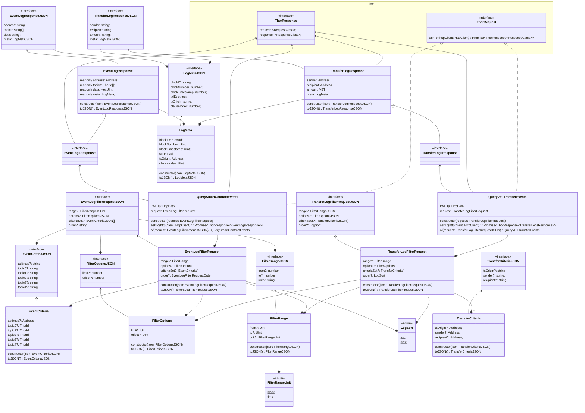

```mermaid
classDiagram
    class EventCriteria {
        address?: Address
        topic0?: ThorId
        topic1?: ThorId
        topic2?: ThorId
        topic3?: ThorId
        topic4?: ThorId
        constructor(json: EventCriteriaJSON)
        toJSON() EventCriteriaJSON
    }
    class EventCriteriaJSON {
        <<interface>>
        address?: string;
        topic0?: string
        topic1?: string
        topic2?: string
        topic3?: string
        topic4?: string
    }
    class EventLogFilterRequest {
        range?: FilterRange
        options?: FilterOptions
        criteriaSet?: EventCriteria[]
        order?: EventLogFilterRequestOrder
        constructor(json: EventLogFilterRequestJSON)
        toJSON() EventLogFilterRequestJSON
    }
    class EventLogFilterRequestJSON {
        <<interface>>
        range?: FilterRangeJSON
        options?: FilterOptionsJSON
        criteriaSet?: EventCriteriaJSON[]
        order?: string
    }
    class EventLogResponse {
        readonly address: Address;
        readonly topics: ThorId[];
        readonly data: HexUInt;
        readonly meta: LogMeta;
        constructor(json: EventLogResponseJSON)
        toJSON() EventLogResponseJSON
    }
    class EventLogResponseJSON {
        <<interface>>
        address: string;
        topics: string[];
        data: string;
        meta: LogMetaJSON;
    }
    class EventLogsResponse {
        <<interface>>
    }
    class FilterOptions {
        limit?: UInt
        offset?: UInt
        constructor(json: FilterOptionsJSON)
        toJSON() FilterOptionsJSON
    }
    class FilterOptionsJSON {
        <<interface>>
        limit?: number
        offset?: number
    }
    class FilterRange {
        from?: UInt
        to?: UInt
        unit?: FilterRangeUnit
        constructor(json: FilterRangeJSON)
        toJSON() FilterRangeJSON
    }
    class FilterRangeJSON {
        <<interface>>
        from?: number
        to?: number
        unit?: string
    }
    class FilterRangeUnit {
        <<enum>>
        block$
        time$
    }
    class LogMeta {
        blockID: BlockId;
        blockNumber: UInt;
        blockTimestamp: UInt;
        txID: TxId;
        txOrigin: Address;
        clauseIndex: UInt;
        constructor(json: LogMetaJSON)
        toJSON() LogMetaJSON
    }
    class LogMetaJSON {
        <<interface>>
        blockID: string;
        blockNumber: number;
        blockTimestamp: number;
        txID: string;
        txOrigin: string;
        clauseIndex: number;
    }
    class LogSort {
        <<enum>>
        asc$
        desc$
    }
    class QuerySmartContractEvents {
        PATH$: HttpPath
        request: EventLogFilterRequest
        constructor(request: EventLogFilterRequest)
        askTo(httpClient: HttpClient): Promise~ThorResponse~EventLogsResponse~~
        of(request: EventLogFilterRequestJSON)$ QuerySmartContractEvents
    }
    class QueryVETTransferEvents {
        PATH$: HttpPath
        request: TransferLogFilterRequest
        constructor(request: TransferLogFilterRequest)
        askTo(httpClient: HttpClient): Promise~ThorResponse~TransferLogsResponse~~
        of(request: TransferLogFilterRequestJSON) QueryVETTransferEvents
    }
    class TransferCriteria {
        txOrigin?: Address;
        sender?: Address;
        recipient?: Address;
        constructor(json: TransferCriteriaJSON)
        toJSON() TransferCriteriaJSON
    }
    class TransferCriteriaJSON {
        <<interface>>
        txOrigin?: string;
        sender?: string;
        recipient?: string;
    }
    class TransferLogFilterRequest {
        range?: FilterRange
        options?: FilterOptions
        criteriaSet?: TransferCriteria[]
        order?: LogSort
        constructor(json: TransferLogFilterRequestJSON)
        toJSON() TransferLogFilterRequestJSON
    }
    class TransferLogFilterRequestJSON {
        <<interface>>
        range?: FilterRangeJSON
        options?: FilterOptionsJSON
        criteriaSet?: TransferCriteriaJSON[]
        order?: LogSort
    }
    class TransferLogResponse {
        sender: Address
        recipient: Address
        amount: VET
        meta: LogMeta
        constructor(json: TransferLogResponseJSON)
        toJSON() TransferLogResponseJSON
    }
    class TransferLogResponseJSON {
        <<interface>>
        sender: string;
        recipient: string;
        amount: string;
        meta: LogMetaJSON;
    }
    class TransferLogsResponse {
        <<interface>>
    }
    namespace thor {
        class ThorRequest {
            <<interface>>
            askTo: (httpClient: HttpClient) Promise~ThorResponse~ResponseClass~~
        }
        class ThorResponse {
            <<interface>>
            request: ~RequestClass~;
            response: ~ResponseClass~;
        }
    }
    EventCriteriaJSON <-- EventCriteria
    EventLogFilterRequestJSON <-- EventLogFilterRequest
    EventLogResponseJSON <-- EventLogResponse
    EventLogsResponse <-- QuerySmartContractEvents
    FilterOptionsJSON <-- FilterOptions
    FilterRangeJSON <-- FilterRange
    LogMetaJSON <-- LogMeta
    TransferCriteriaJSON <-- TransferCriteria
    TransferLogFilterRequestJSON <-- TransferLogFilterRequest
    TransferLogResponseJSON <-- TransferLogResponse
    TransferLogsResponse <-- QueryVETTransferEvents
    ThorResponse <-- EventLogsResponse
    ThorResponse <-- TransferLogResponse
    ThorResponse <-- QuerySmartContractEvents
    ThorResponse <-- QueryVETTransferEvents
    ThorRequest <|.. QuerySmartContractEvents
    ThorRequest <|.. QueryVETTransferEvents
    EventLogResponse "*" o-- EventLogsResponse
    TransferLogResponse "*" o-- TransferLogsResponse
    EventLogFilterRequest --* FilterRange
    EventLogFilterRequest --* FilterOptions
    EventLogFilterRequest --* EventCriteria
    EventLogFilterRequest --* LogSort
    EventLogFilterRequestJSON --* FilterRangeJSON
    EventLogFilterRequestJSON --* FilterOptionsJSON
    EventLogFilterRequestJSON --* EventCriteriaJSON
    EventLogResponse --* LogMeta
    EventLogResponseJSON --* LogMetaJSON
    FilterRange --* FilterRangeUnit
    QuerySmartContractEvents --* EventLogFilterRequest
    QueryVETTransferEvents  --* TransferLogFilterRequest
    TransferLogFilterRequest --* FilterRange
    TransferLogFilterRequest --* FilterOptions
    TransferLogFilterRequest --* "*" TransferCriteria
    TransferLogFilterRequest --* LogSort
    TransferLogResponse --* LogMeta
    TransferLogResponseJSON --* LogMetaJSON
```
