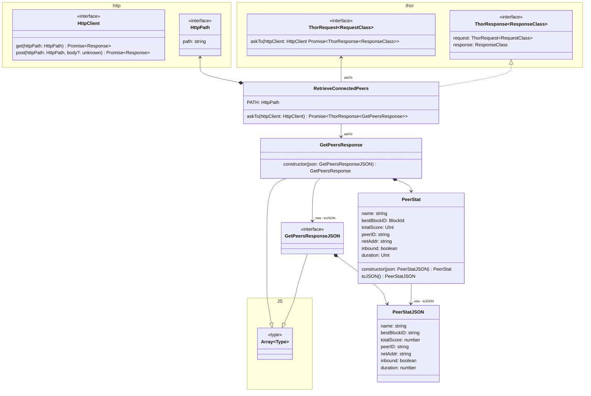

```mermaid
classDiagram
    namespace JS {
        class Array~Type~ {
            <<type>>
        }
    }
    namespace http {
        class HttpClient {
            <<interface>>
            get(httpPath: HttpPath) Promise~Response~
            post(httpPath: HttpPath, body?: unknown) Promise~Response~
        }
        class HttpPath {
            <<interface>>
            path: string
        }
    }
    namespace thor {
        class ThorRequest~RequestClass~ {
            <<interface>>
            askTo(httpClient: HttpClient Promise~ThorResponse~ResponseClass~~
        }
        class ThorResponse~ResponseClass~ {
            <<interface>>
            request: ThorRequest~RequestClass~
            response: ResponseClass
        }
    }
    class GetPeersResponse {
        constructor(json: GetPeersResponseJSON) GetPeersResponse
    }
    class GetPeersResponseJSON {
        <<interface>>
    }
    class PeerStat {
        name: string
        bestBlockID: BlockId
        totalScore: UInt
        peerID: string
        netAddr: string
        inbound: boolean
        duration: UInt
        constructor(json: PeerStatJSON) PeerStat
        toJSON() PeerStatJSON
    }
    class PeerStatJSON {
        name: string
        bestBlockID: string
        totalScore: number
        peerID: string
        netAddr: string
        inbound: boolean
        duration: number
    }
    class RetrieveConnectedPeers {
        PATH: HttpPath
        askTo(httpClient: HttpClient) Promise~ThorResponse~GetPeersResponse~~
    }
    GetPeersResponse *--> PeerStat
    GetPeersResponse --> "new - toJSON" GetPeersResponseJSON
    GetPeersResponse --|> Array
    GetPeersResponseJSON --|> Array
    GetPeersResponseJSON *--> PeerStatJSON
    HttpPath <--* RetrieveConnectedPeers
    PeerStat --> "new - toJSON" PeerStatJSON
    RetrieveConnectedPeers --> "askTo" GetPeersResponse
    ThorRequest <-- "askTo" RetrieveConnectedPeers
    ThorResponse <|.. RetrieveConnectedPeers
```
