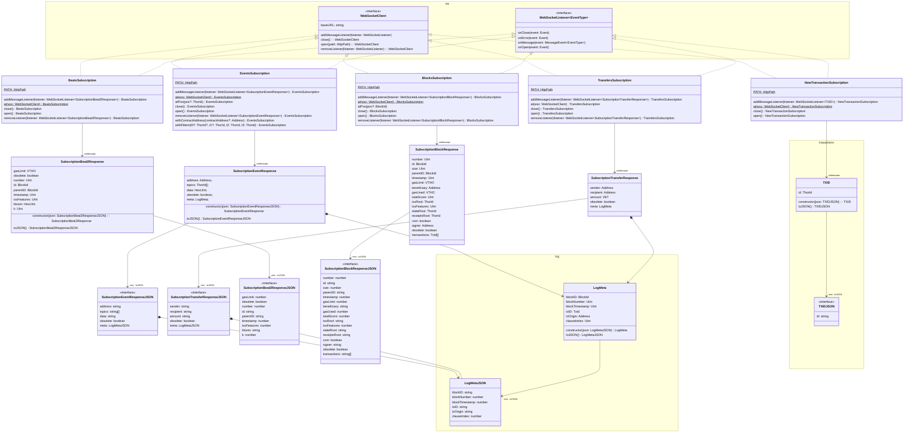

```mermaid
classDiagram
    namespace log {
        class LogMeta {
            blockID: BlockId
            blockNumber: UInt
            blockTimestamp: UInt
            txID: TxId
            txOrigin: Address
            clauseIndex: UInt
            constructor(json: LogMetaJSON) LogMeta
            toJSON() LogMetaJSON
        }
        class LogMetaJSON {
            blockID: string
            blockNumber: number
            blockTimestamp: number
            txID: string
            txOrigin: string
            clauseIndex: number
        }
    }
    namespace trasactions {
        class TXID {
            id: ThorId
            constructor(json: TXIDJSON): TXID
            toJSON() TXIDJSON
        }
        class TXIDJSON {
            <<interface>>
            id: string
        }
    }
    namespace ws {
        class WebSocketClient {
            <<interface>>
            baseURL: string
            addMessageListener(listener: WebSocketListener)
            close(): WebSocketClient
            open(path: HttpPath): WebSocketClient
            removeListener(listener: WebSocketListener): WebSocketClient
        }
        class WebSocketListener~EventType~ {
            <<interface>>
            onClose(event: Event)
            onError(event: Event)
            onMessage(event: MessageEvent~EventType~)
            onOpen(event: Event)
        }
    }
    class BeatsSubscription {
        PATH: HttpPath$
        addMessageListener(listener: WebSocketListener~SubscriptionBeat2Response~) BeatsSubscription
        at(wsc: WebSocketClient) BeatsSubscription$
        close() BeatsSubscription
        open() BeatsSubscription
        removeListener(listener: WebSocketListener~SubscriptionBeat2Response~) BeatsSubscription
    }
    class BlocksSubscription {
        PATH: HttpPath$
        addMessageListener(listener: WebSocketListener~SubscriptionBlockResponse~) BlocksSubscription
        at(wsc: WebSocketClient) BlocksSubscription$
        atPos(pos?: BlockId)
        close() BlocksSubscription
        open() BlocksSubscription
        removeListener(listener: WebSocketListener~SubscriptionBlockResponse~) BlocksSubscription
    }
    class EventsSubscription {
        PATH: HttpPath$
        addMessageListener(listener: WebSocketListener~SubscriptionEventResponse~) EventsSubscription
        at(wsc: WebSocketClient) EventsSubscription$
        atPos(pos?: ThorId) EventsSubscription
        close() EventsSubscription
        open() EventsSubscription
        removeListener(listener: WebSocketListener~SubscriptionEventResponse~) EventsSubscription
        withContractAddress(contractAddress?: Address) EventsSubscription
        withFilters(t0?: ThorId?, t1?: ThorId, t2: ThorId, t3: ThorId) EventsSubscription
    }
    class NewTransactionSubscription {
        PATH: HttpPath$
        addMessageListener(listener: WebSocketListener~TXID~) NewTransactionSubscription
        at(wsc: WebSocketClient) NewTransactionSubscription$
        close() NewTransactionSubscription
        open() NewTransactionSubscription
    }
    class TransfersSubscription {
        PATH: HttpPath$
        addMessageListener(listener: WebSocketListener~SubscriptionTransferResponse~) TransfersSubscription
        at(wsc: WebSocketClient) TransfersSubscription
        close() TransfersSubscription
        open() TransfersSubscription
        removeListener(listener: WebSocketListener~SubscriptionTransferResponse~) TransfersSubscription
    }
    class SubscriptionBeat2Response {
        gasLimit: VTHO
        obsolete: boolean
        number: UInt
        id: BlockId
        parentID: BlockId
        timestamp: UInt
        txsFeatures: UInt
        bloom: HexUInt
        k: UInt
        constructor(json: SubscriptionBeat2ResponseJSON): SubscriptionBeat2Response
        toJSON() SubscriptionBeat2ResponseJSON
    }
    class SubscriptionBeat2ResponseJSON {
        <<interface>>
        gasLimit: number
        obsolete: boolean
        number: number
        id: string
        parentID: string
        timestamp: number
        txsFeatures: number
        bloom: string
        k: number
    }
    class SubscriptionBlockResponse {
        number: UInt
        id: BlockId
        size: UInt
        parentID: BlockId
        timestamp: UInt
        gasLimit: VTHO
        beneficiary: Address
        gasUsed: VTHO
        totalScore: UInt
        txsRoot: ThorId
        txsFeatures: UInt
        stateRoot: ThorId
        receiptsRoot: ThorId
        com: boolean
        signer: Address
        obsolete: boolean
        transactions: TxId[]
    }
    class SubscriptionBlockResponseJSON {
        <<interface>>
        number: number
        id: string
        size: number
        parentID: string
        timestamp: number
        gasLimit: number
        beneficiary: string
        gasUsed: number
        totalScore: number
        txsRoot: string
        txsFeatures: number
        stateRoot: string
        receiptsRoot: string
        com: boolean
        signer: string
        obsolete: boolean
        transactions: string[]
    }
    class SubscriptionEventResponse {
        address: Address;
        topics: ThorId[];
        data: HexUInt;
        obsolete: boolean;
        meta: LogMeta;
        constructor(json: SubscriptionEventResponseJSON) SubscriptionEventResponse
        toJSON() SubscriptionEventResponseJSON
    }
    class SubscriptionEventResponseJSON {
        <<interface>>
        address: string
        topics: string[]
        data: string
        obsolete: boolean
        meta: LogMetaJSON
    }
    class SubscriptionTransferResponse {
        sender: Address
        recipient: Address
        amount: VET
        obsolete: boolean
        meta: LogMeta
    }
    class SubscriptionTransferResponseJSON {
        <<interface>>
        sender: string
        recipient: string
        amount: string
        obsolete: boolean
        meta: LogMetaJSON
    }
    WebSocketClient <|.. BeatsSubscription
    WebSocketClient <|.. BlocksSubscription
    WebSocketClient <|.. EventsSubscription
    WebSocketClient <|.. NewTransactionSubscription
    WebSocketClient <|.. TransfersSubscription
    WebSocketListener <|.. BeatsSubscription
    WebSocketListener <|.. BlocksSubscription
    WebSocketListener <|.. EventsSubscription
    WebSocketListener <|.. NewTransactionSubscription
    WebSocketListener <|.. TransfersSubscription
    BeatsSubscription --> "onMessage" SubscriptionBeat2Response
    BlocksSubscription --> "onMessage" SubscriptionBlockResponse
    EventsSubscription --> "onMessage" SubscriptionEventResponse
    NewTransactionSubscription --> "onMessage" TXID
    TransfersSubscription --> "onMessage" SubscriptionTransferResponse
    SubscriptionEventResponse *--> LogMeta
    SubscriptionEventResponseJSON *--> LogMetaJSON
    SubscriptionTransferResponse *--> LogMeta
    SubscriptionTransferResponseJSON *-- LogMetaJSON
    LogMeta --> "new - toJSON" LogMetaJSON
    SubscriptionBeat2Response --> "new - toJSON" SubscriptionBeat2ResponseJSON
    SubscriptionBlockResponse --> "new - toJSON" SubscriptionBlockResponseJSON
    SubscriptionEventResponse --> "new - toJSON" SubscriptionEventResponseJSON
    SubscriptionTransferResponse --> "new - toJSON" SubscriptionTransferResponseJSON
    TXID --> "new - toJSON" TXIDJSON
```
