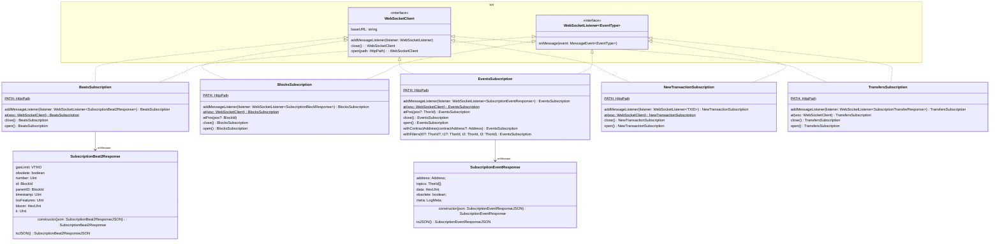

```mermaid
classDiagram
    namespace ws {
        class WebSocketClient {
            <<interface>>
            baseURL: string
            addMessageListener(listener: WebSocketListener)
            close(): WebSocketClient
            open(path: HttpPath): WebSocketClient
        }
        class WebSocketListener~EventType~ {
            <<interface>>
            onMessage(event: MessageEvent~EventType~)
        }
    }
    class BeatsSubscription {
        PATH: HttpPath$
        addMessageListener(listener: WebSocketListener~SubscriptionBeat2Response~) BeatsSubscription
        at(wsc: WebSocketClient) BeatsSubscription$
        close() BeatsSubscription
        open() BeatsSubscription
    }
    class BlocksSubscription {
        PATH: HttpPath$
        addMessageListener(listener: WebSocketListener~SubscriptionBlockResponse~) BlocksSubscription
        at(wsc: WebSocketClient) BlocksSubscription$
        atPos(pos?: BlockId)
        close() BlocksSubscription
        open() BlocksSubscription
    }
    class EventsSubscription {
        PATH: HttpPath$
        addMessageListener(listener: WebSocketListener~SubscriptionEventResponse~) EventsSubscription
        at(wsc: WebSocketClient) EventsSubscription$
        atPos(pos?: ThorId) EventsSubscription
        close() EventsSubscription
        open() EventsSubscription
        withContractAddress(contractAddress?: Address) EventsSubscription
        withFilters(t0?: ThorId?, t1?: ThorId, t2: ThorId, t3: ThorId) EventsSubscription
    }
    class NewTransactionSubscription {
        PATH: HttpPath$
        addMessageListener(listener: WebSocketListener~TXID~) NewTransactionSubscription
        at(wsc: WebSocketClient) NewTransactionSubscription$
        close() NewTransactionSubscription
        open() NewTransactionSubscription
    }
    class TransfersSubscription {
        PATH: HttpPath$
        addMessageListener(listener: WebSocketListener~SubscriptionTransferResponse~) TransfersSubscription
        at(wsc: WebSocketClient) TransfersSubscription
        close() TransfersSubscription
        open() TransfersSubscription
    }
    class SubscriptionBeat2Response {
        gasLimit: VTHO
        obsolete: boolean
        number: UInt
        id: BlockId
        parentID: BlockId
        timestamp: UInt
        txsFeatures: UInt
        bloom: HexUInt
        k: UInt
        constructor(json: SubscriptionBeat2ResponseJSON): SubscriptionBeat2Response
        toJSON() SubscriptionBeat2ResponseJSON
    }
    class SubscriptionEventResponse {
        address: Address;
        topics: ThorId[];
        data: HexUInt;
        obsolete: boolean;
        meta: LogMeta;
        constructor(json: SubscriptionEventResponseJSON) SubscriptionEventResponse
        toJSON() SubscriptionEventResponseJSON
    }
    WebSocketClient <|.. BeatsSubscription
    WebSocketClient <|.. BlocksSubscription
    WebSocketClient <|.. EventsSubscription
    WebSocketClient <|.. NewTransactionSubscription
    WebSocketClient <|.. TransfersSubscription
    WebSocketListener <|.. BeatsSubscription
    WebSocketListener <|.. BlocksSubscription
    WebSocketListener <|.. EventsSubscription
    WebSocketListener <|.. NewTransactionSubscription
    WebSocketListener <|.. TransfersSubscription
    BeatsSubscription --> "onMessage" SubscriptionBeat2Response
    EventsSubscription --> "onMessage" SubscriptionEventResponse
```
