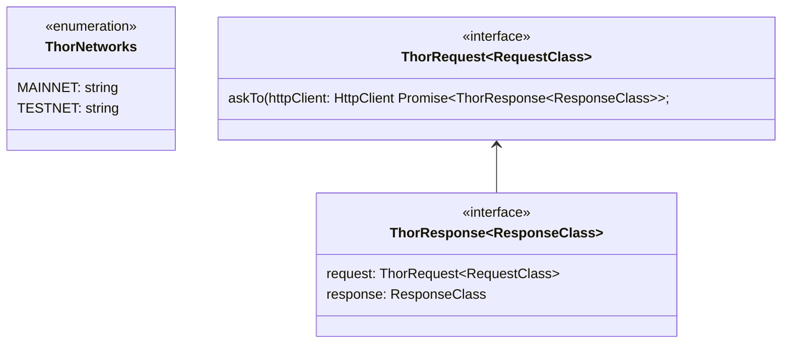

```mermaid
classDiagram
    class ThorNetworks {
        <<enumeration>>
        MAINNET: string
        TESTNET: string
    }
    class ThorRequest~RequestClass~ {
        <<interface>>
        askTo(httpClient: HttpClient Promise~ThorResponse~ResponseClass~~;
    }
    class ThorResponse~ResponseClass~ {
        <<interface>>
        request: ThorRequest~RequestClass~
        response: ResponseClass
    }
    ThorRequest <-- ThorResponse
```
