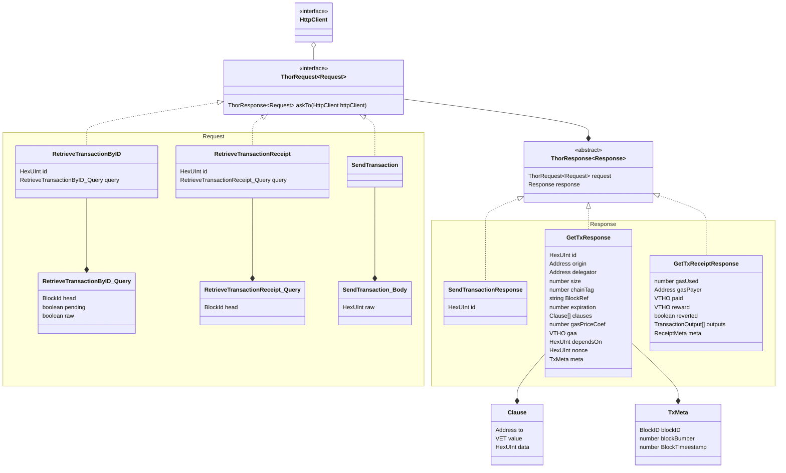

```mermaid
classDiagram
    class HttpClient {
        <<interface>>
    }
    class ThorRequest~Request~ {
        <<interface>>
        ThorResponse~Request~ askTo(HttpClient httpClient)
    }
    class ThorResponse~Response~ {
        <<abstract>>
        ThorRequest~Request~ request
        Response response
    }
    namespace Request {
        class RetrieveTransactionByID {
            HexUInt id
            RetrieveTransactionByID_Query query
        }
        class RetrieveTransactionByID_Query {
            BlockId head
            boolean pending
            boolean raw
        }
        class RetrieveTransactionReceipt {
            HexUInt id
            RetrieveTransactionReceipt_Query query
        }
        class RetrieveTransactionReceipt_Query {
            BlockId head
        }
        class SendTransaction {
        }
        class SendTransaction_Body {
            HexUInt raw
        }
    }
    namespace Response {
        class SendTransactionResponse {
            HexUInt id
        }
        class GetTxResponse {
            HexUInt id
            Address origin
            Address delegator
            number size
            number chainTag
            string BlockRef
            number expiration
            Clause[] clauses
            number gasPriceCoef
            VTHO gaa
            HexUInt dependsOn
            HexUInt nonce
            TxMeta meta
        }
        class GetTxReceiptResponse {
            number gasUsed
            Address gasPayer
            VTHO paid
            VTHO reward
            boolean reverted
            TransactionOutput[] outputs
            ReceiptMeta meta
        }
    }
    class Clause {
        Address to
        VET value
        HexUInt data
    }
    class TxMeta {
        BlockID blockID
        number blockBumber
        number BlockTimeestamp
    }
    
    HttpClient o-- ThorRequest
    
    ThorRequest <|.. RetrieveTransactionByID
    ThorRequest <|.. RetrieveTransactionReceipt
    ThorRequest <|.. SendTransaction
    
    ThorRequest --* ThorResponse
    
    ThorResponse <|.. GetTxResponse
    ThorResponse <|.. GetTxReceiptResponse
    ThorResponse <|.. SendTransactionResponse
    
    RetrieveTransactionByID --* RetrieveTransactionByID_Query
    RetrieveTransactionReceipt --* RetrieveTransactionReceipt_Query
    SendTransaction --* SendTransaction_Body
    
    GetTxResponse --* Clause
    GetTxResponse --* TxMeta
    
```
